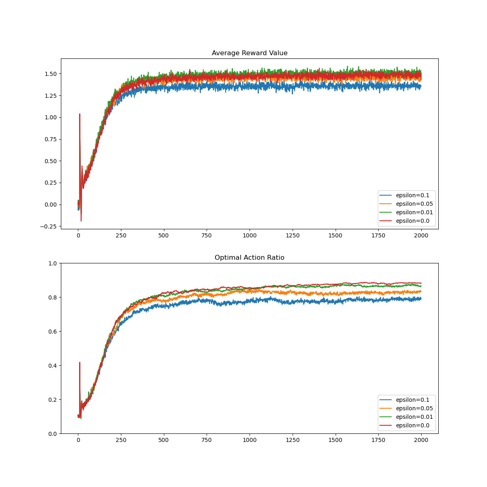
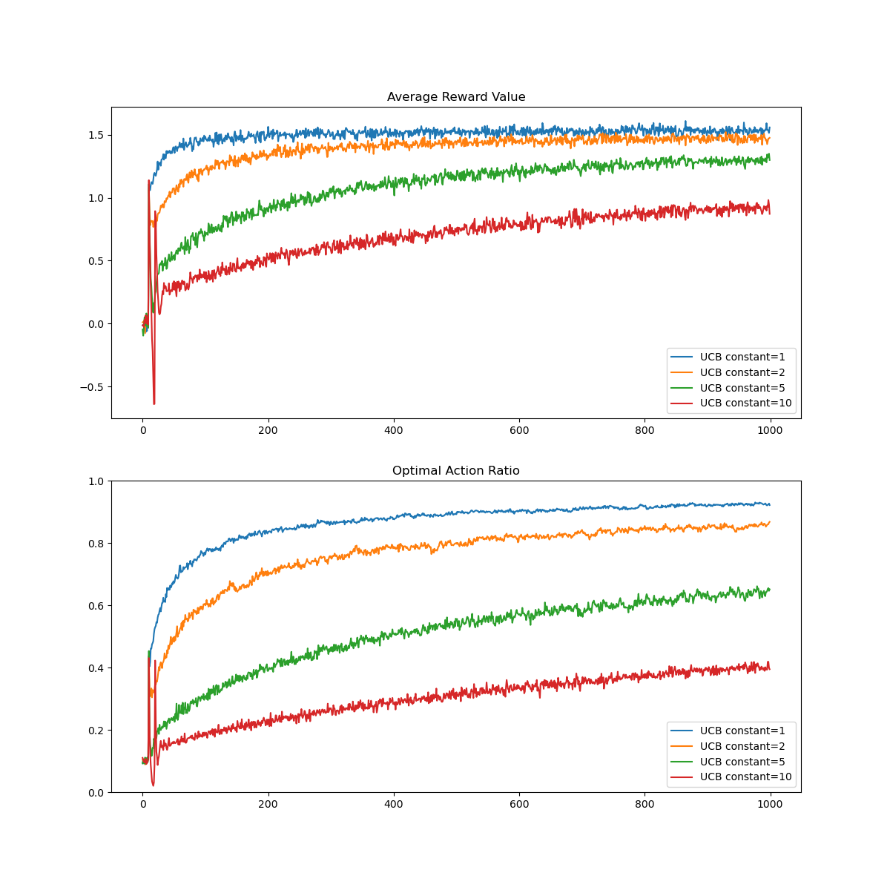

# Reinforcement Learning: An Introduction

These are notes and results from implementations of various examples
and algorithms from throughout the book.

## Chapter 2: Multi-armed Bandits

### K-armed Bandit Testbed Implementation

#### Graphs for basic implementation with various parameters

- 10 arms
- $\epsilon$-greedy values: .1, .05, .01, 0
- averages over 2000 runs
- 1000 steps


- 10 arms
- $\epsilon$-greedy values: .1, .05, .01, 0
- averages over 2000 runs
- 1000 steps
- optimistic initial value of 5
- non-stationary update rule



- 10 arms
- UCB constant values: 1, 2, 5, 10
- averages over 2000 runs
- 1000 steps



## Chapter 4: Dynamic Programming

$\pi_\star$ for $4\times4$ deterministic GridWorld MDP:

```
[ 0 0 0 0
  1 0 0 3
  1 0 2 3
  1 2 2 0]
```

State value prediction using $p_\star$ (above):

```
[ 0. -1. -2. -3.
 -1. -2. -3. -2.
 -2. -3. -2. -1.
 -3. -2. -1.  0.]
```

State-action value prediction using $p_\star$ (above):

```
[[ 0.  0.  0.  0.]
 [-1. -2. -3. -3.]
 [-2. -3. -4. -4.]
 [-3. -4. -4. -3.]
 [-2. -1. -3. -3.]
 [-2. -2. -4. -4.]
 [-3. -3. -3. -3.]
 [-4. -4. -3. -2.]
 [-3. -2. -4. -4.]
 [-3. -3. -3. -3.]
 [-4. -4. -2. -2.]
 [-3. -3. -2. -1.]
 [-4. -3. -3. -4.]
 [-4. -4. -2. -3.]
 [-3. -3. -1. -2.]
 [ 0.  0.  0.  0.]]
 ```

State value prediction using an equiprobable random policy:

```
[  0.         -13.99893866 -19.99842728 -21.99824003
 -13.99893866 -17.99861452 -19.9984378  -19.99842728
 -19.99842728 -19.9984378  -17.99861452 -13.99893866
 -21.99824003 -19.99842728 -13.99893866   0.        ]
 ```

State-action value prediction using an equiprobable random policy:

```
[[  0.           0.           0.           0.        ]
 [ -1.         -14.99887902 -20.99833891 -18.99853668]
 [-14.99887902 -20.99833891 -22.99814115 -20.99835003]
 [-20.99833891 -22.99814115 -22.99814115 -20.99833891]
 [-14.99887902  -1.         -18.99853668 -20.99833891]
 [-14.99887902 -14.99887902 -20.99835003 -20.99835003]
 [-18.99853668 -20.99833891 -20.99833891 -18.99853668]
 [-20.99835003 -22.99814115 -20.99833891 -14.99887902]
 [-20.99833891 -14.99887902 -20.99835003 -22.99814115]
 [-20.99833891 -18.99853668 -18.99853668 -20.99833891]
 [-20.99835003 -20.99835003 -14.99887902 -14.99887902]
 [-18.99853668 -20.99833891 -14.99887902  -1.        ]
 [-22.99814115 -20.99833891 -20.99833891 -22.99814115]
 [-22.99814115 -20.99835003 -14.99887902 -20.99833891]
 [-20.99833891 -18.99853668  -1.         -14.99887902]
 [  0.           0.           0.           0.        ]]
```

## Chapter 5: Monte Carlo Methods

First visit state value prediction using an equiprobable random policy with 100000 trajectories/episodes:

```
[  0.          -4.89446992  -8.28628159 -10.41292918
  -4.90394671  -6.45359771  -7.67281568  -8.25182539
  -8.22930065  -7.65805575  -6.49836474  -4.92075885
  -10.42069993  -8.08775559  -4.86703613  0.]
```

Every visit state value prediction using an equiprobable random policy with 100000 trajectories/episodes:

```
[  0.         -13.89942518 -19.84722623 -21.8641906
 -13.99492976 -17.95387222 -19.86638925 -19.79371526
 -19.80255672 -19.91403795 -17.90539881 -13.91110278
 -21.88796227 -19.92882583 -13.8152689    0.]
```

Policy iteration ($\pi \approx \pi_\star$) with exploring starts from an equiprobable random policy with 100000 trajectories/episodes

```
[0 0 0 3
 1 0 3 3
 1 2 2 3
 1 2 2 0]
 ```

On-policy state-action value prediction with exploring starts from an equiprobable random policy with 100000 trajectories/episodes

```
[[  0.           0.           0.           0.        ]
 [ -1.         -14.78654229 -21.02331045 -18.99832389]
 [-14.888272   -21.01292305 -22.93211709 -21.19819901]
 [-20.97189294 -22.83740889 -22.77129636 -20.88062269]
 [-15.02362072  -1.         -18.96773724 -21.05037401]
 [-14.88742304 -15.03271226 -21.06039434 -21.03715862]
 [-19.04281462 -21.00959366 -21.18797805 -19.04468586]
 [-21.08256389 -22.91684219 -21.00897127 -15.0288286 ]
 [-21.28437903 -15.05760307 -21.07756962 -23.11239939]
 [-21.13327091 -19.01649633 -19.07661973 -21.12922396]
 [-20.98453251 -21.03514459 -15.18223422 -15.23848945]
 [-19.19881265 -20.94675381 -14.99930598  -1.        ]
 [-22.94921231 -21.09683225 -20.99841692 -22.88845156]
 [-22.9758971  -21.21682513 -15.01800612 -20.92207382]
 [-21.00239041 -19.25709616  -1.         -15.12323233]
 [  0.           0.           0.           0.        ]]
```

On-policy action-state value prediction with ordinary importance sampling from an equiprobable random policy with 100000 trajectories/episodes:

```
[[  0.           0.           0.           0.        ]
 [ -1.         -14.93732002 -20.65596439 -18.98024023]
 [-14.92924613 -20.94580603 -22.77849491 -20.8730485 ]
 [-20.93416407 -23.00568907 -23.04810873 -20.9515844 ]
 [-14.74453998  -1.         -19.03368483 -21.10372025]
 [-14.96605794 -14.81492962 -21.16037603 -20.92132003]
 [-18.90889809 -20.92916809 -21.24052264 -18.7621847 ]
 [-21.05174528 -23.04091114 -20.93321441 -15.08745978]
 [-21.08413334 -15.13103614 -20.97836385 -22.95691604]
 [-21.07546343 -18.9160906  -18.97370322 -21.01224361]
 [-20.92686612 -20.90305399 -14.97498954 -14.91383422]
 [-19.10079423 -21.06416769 -14.92774105  -1.        ]
 [-23.09970572 -20.90189895 -21.02428339 -22.91837707]
 [-22.89908644 -21.09541354 -15.13498845 -20.99862444]
 [-21.06629926 -18.9337005   -1.         -14.91102849]
 [  0.           0.           0.           0.        ]]
```

On-policy action-state value prediction with weighted importance sampling from an equiprobable random policy with 100000 trajectories/episodes:

```
[[  0.           0.           0.           0.        ]
 [ -1.         -14.93732002 -20.65596439 -18.98024023]
 [-14.92924613 -20.94580603 -22.77849491 -20.8730485 ]
 [-20.93416407 -23.00568907 -23.04810873 -20.9515844 ]
 [-14.74453998  -1.         -19.03368483 -21.10372025]
 [-14.96605794 -14.81492962 -21.16037603 -20.92132003]
 [-18.90889809 -20.92916809 -21.24052264 -18.7621847 ]
 [-21.05174528 -23.04091114 -20.93321441 -15.08745978]
 [-21.08413334 -15.13103614 -20.97836385 -22.95691604]
 [-21.07546343 -18.9160906  -18.97370322 -21.01224361]
 [-20.92686612 -20.90305399 -14.97498954 -14.91383422]
 [-19.10079423 -21.06416769 -14.92774105  -1.        ]
 [-23.09970572 -20.90189895 -21.02428339 -22.91837707]
 [-22.89908644 -21.09541354 -15.13498845 -20.99862444]
 [-21.06629926 -18.9337005   -1.         -14.91102849]
 [ 0.            0.           0.           0.        ]]
```

For off-policy prediction, the following $p_\star$ was used:

```
[0, 0, 0, 0,
 1, 0, 0, 3,
 1, 0, 2, 3,
 1, 2, 2, 0]
```

Off-policy action-state value prediction with ordinary importance sampling from an optimal evaluation/target policy and an equiprobable random behavior policy with 100000 trajectories/episodes:

```
[[ 0.          0.          0.          0.        ]
 [-1.         -1.9992374  -2.97363796 -2.99999647]
 [-2.00019191 -2.99966621 -4.00683547 -4.04537815]
 [-3.00693474 -4.12674185 -3.99869607 -3.00069339]
 [-2.         -1.         -3.         -3.00075366]
 [-1.9999781  -2.         -3.98122063 -3.99649069]
 [-3.00611111 -3.00075473 -3.00043779 -3.00331997]
 [-4.00229134 -3.99450818 -3.00488347 -1.99987431]
 [-2.99952409 -1.99999014 -4.00056357 -6.74039915]
 [-2.9999996  -3.00001676 -2.99993315 -2.99998889]
 [-3.75728522 -4.642233   -2.00009175 -2.00007735]
 [-3.00607859 -3.00119999 -1.99905125 -1.        ]
 [-4.00821703 -3.00071329 -3.00026275 -4.00481858]
 [-3.9868127  -3.9976738  -1.99996913 -3.00001453]
 [-2.99945503 -3.00811211 -1.         -1.99954542]
 [ 0.          0.          0.          0.        ]]
```

Off-policy action-state value prediction with weighted importance sampling from an optimal evaluation/target policy and an equiprobable random behavior policy with 100000 trajectories/episodes:

```
[[ 0.  0.  0.  0.]
 [-1. -2. -3. -3.]
 [-2. -3. -4. -4.]
 [-3. -4. -4. -3.]
 [-2. -1. -3. -3.]
 [-2. -2. -4. -4.]
 [-3. -3. -3. -3.]
 [-4. -4. -3. -2.]
 [-3. -2. -4. -4.]
 [-3. -3. -3. -3.]
 [-4. -4. -2. -2.]
 [-3. -3. -2. -1.]
 [-4. -3. -3. -4.]
 [-4. -4. -2. -3.]
 [-3. -3. -1. -2.]
 [ 0.  0.  0.  0.]]
```

## Chapter 6: Temporal-Difference Learning
