# Reinforcement Learning: An Introduction

These are notes and results from implementations of various examples
and algorithms from throughout the book.

## Chapter 2: Multi-armed Bandits

### K-armed Bandit Testbed Implementation

#### Graphs for basic implementation with various parameters

- 10 arms
- $\epsilon$-greedy values: .1, .05, .01, 0
- averages over 2000 runs
- 1000 steps


- 10 arms
- $\epsilon$-greedy values: .1, .05, .01, 0
- averages over 2000 runs
- 1000 steps
- optimistic initial value of 5
- non-stationary update rule


- 10 arms
- UCB constant values: 1, 2, 5, 10
- averages over 2000 runs
- 1000 steps


## Chapter 4: Dynamic Programming

Note: Unless otherwise noted, all examples used a $4\times4$ deterministic GridWorld MDP.

$\pi_\star$:

```
[ 0 0 0 0
  1 0 0 3
  1 0 2 3
  1 2 2 0]
```

State value prediction using $p_\star$ (above):

```
[ 0. -1. -2. -3.
 -1. -2. -3. -2.
 -2. -3. -2. -1.
 -3. -2. -1.  0.]
```

State-action value prediction using $p_\star$ (above):

```
[[ 0.  0.  0.  0.]
 [-1. -2. -3. -3.]
 [-2. -3. -4. -4.]
 [-3. -4. -4. -3.]
 [-2. -1. -3. -3.]
 [-2. -2. -4. -4.]
 [-3. -3. -3. -3.]
 [-4. -4. -3. -2.]
 [-3. -2. -4. -4.]
 [-3. -3. -3. -3.]
 [-4. -4. -2. -2.]
 [-3. -3. -2. -1.]
 [-4. -3. -3. -4.]
 [-4. -4. -2. -3.]
 [-3. -3. -1. -2.]
 [ 0.  0.  0.  0.]]
 ```

State value prediction using an equiprobable random policy:

```
[  0.         -13.99893866 -19.99842728 -21.99824003
 -13.99893866 -17.99861452 -19.9984378  -19.99842728
 -19.99842728 -19.9984378  -17.99861452 -13.99893866
 -21.99824003 -19.99842728 -13.99893866   0.        ]
 ```

State-action value prediction using an equiprobable random policy:

```
[[  0.           0.           0.           0.        ]
 [ -1.         -14.99887902 -20.99833891 -18.99853668]
 [-14.99887902 -20.99833891 -22.99814115 -20.99835003]
 [-20.99833891 -22.99814115 -22.99814115 -20.99833891]
 [-14.99887902  -1.         -18.99853668 -20.99833891]
 [-14.99887902 -14.99887902 -20.99835003 -20.99835003]
 [-18.99853668 -20.99833891 -20.99833891 -18.99853668]
 [-20.99835003 -22.99814115 -20.99833891 -14.99887902]
 [-20.99833891 -14.99887902 -20.99835003 -22.99814115]
 [-20.99833891 -18.99853668 -18.99853668 -20.99833891]
 [-20.99835003 -20.99835003 -14.99887902 -14.99887902]
 [-18.99853668 -20.99833891 -14.99887902  -1.        ]
 [-22.99814115 -20.99833891 -20.99833891 -22.99814115]
 [-22.99814115 -20.99835003 -14.99887902 -20.99833891]
 [-20.99833891 -18.99853668  -1.         -14.99887902]
 [  0.           0.           0.           0.        ]]
```

## Chapter 5: Monte Carlo Methods

First visit state value prediction using an equiprobable random policy with 100000 trajectories/episodes:

```
[  0.          -4.89446992  -8.28628159 -10.41292918
  -4.90394671  -6.45359771  -7.67281568  -8.25182539
  -8.22930065  -7.65805575  -6.49836474  -4.92075885
  -10.42069993  -8.08775559  -4.86703613  0.]
```

Every visit state value prediction using an equiprobable random policy with 100000 trajectories/episodes:

```
[  0.         -13.89942518 -19.84722623 -21.8641906
 -13.99492976 -17.95387222 -19.86638925 -19.79371526
 -19.80255672 -19.91403795 -17.90539881 -13.91110278
 -21.88796227 -19.92882583 -13.8152689    0.]
```

Policy iteration ($\pi \approx \pi_\star$) with exploring starts from an equiprobable random policy with 100000 trajectories/episodes

```
[0 0 0 3
 1 0 3 3
 1 2 2 3
 1 2 2 0]
 ```

On-policy state-action value prediction with exploring starts from an equiprobable random policy with 100000 trajectories/episodes

```
[[  0.           0.           0.           0.        ]
 [ -1.         -14.78654229 -21.02331045 -18.99832389]
 [-14.888272   -21.01292305 -22.93211709 -21.19819901]
 [-20.97189294 -22.83740889 -22.77129636 -20.88062269]
 [-15.02362072  -1.         -18.96773724 -21.05037401]
 [-14.88742304 -15.03271226 -21.06039434 -21.03715862]
 [-19.04281462 -21.00959366 -21.18797805 -19.04468586]
 [-21.08256389 -22.91684219 -21.00897127 -15.0288286 ]
 [-21.28437903 -15.05760307 -21.07756962 -23.11239939]
 [-21.13327091 -19.01649633 -19.07661973 -21.12922396]
 [-20.98453251 -21.03514459 -15.18223422 -15.23848945]
 [-19.19881265 -20.94675381 -14.99930598  -1.        ]
 [-22.94921231 -21.09683225 -20.99841692 -22.88845156]
 [-22.9758971  -21.21682513 -15.01800612 -20.92207382]
 [-21.00239041 -19.25709616  -1.         -15.12323233]
 [  0.           0.           0.           0.        ]]
```

On-policy action-state value prediction with ordinary importance sampling from an equiprobable random policy with 100000 trajectories/episodes:

```
[[  0.           0.           0.           0.        ]
 [ -1.         -14.93732002 -20.65596439 -18.98024023]
 [-14.92924613 -20.94580603 -22.77849491 -20.8730485 ]
 [-20.93416407 -23.00568907 -23.04810873 -20.9515844 ]
 [-14.74453998  -1.         -19.03368483 -21.10372025]
 [-14.96605794 -14.81492962 -21.16037603 -20.92132003]
 [-18.90889809 -20.92916809 -21.24052264 -18.7621847 ]
 [-21.05174528 -23.04091114 -20.93321441 -15.08745978]
 [-21.08413334 -15.13103614 -20.97836385 -22.95691604]
 [-21.07546343 -18.9160906  -18.97370322 -21.01224361]
 [-20.92686612 -20.90305399 -14.97498954 -14.91383422]
 [-19.10079423 -21.06416769 -14.92774105  -1.        ]
 [-23.09970572 -20.90189895 -21.02428339 -22.91837707]
 [-22.89908644 -21.09541354 -15.13498845 -20.99862444]
 [-21.06629926 -18.9337005   -1.         -14.91102849]
 [  0.           0.           0.           0.        ]]
```

On-policy action-state value prediction with weighted importance sampling from an equiprobable random policy with 100000 trajectories/episodes:

```
[[  0.           0.           0.           0.        ]
 [ -1.         -14.93732002 -20.65596439 -18.98024023]
 [-14.92924613 -20.94580603 -22.77849491 -20.8730485 ]
 [-20.93416407 -23.00568907 -23.04810873 -20.9515844 ]
 [-14.74453998  -1.         -19.03368483 -21.10372025]
 [-14.96605794 -14.81492962 -21.16037603 -20.92132003]
 [-18.90889809 -20.92916809 -21.24052264 -18.7621847 ]
 [-21.05174528 -23.04091114 -20.93321441 -15.08745978]
 [-21.08413334 -15.13103614 -20.97836385 -22.95691604]
 [-21.07546343 -18.9160906  -18.97370322 -21.01224361]
 [-20.92686612 -20.90305399 -14.97498954 -14.91383422]
 [-19.10079423 -21.06416769 -14.92774105  -1.        ]
 [-23.09970572 -20.90189895 -21.02428339 -22.91837707]
 [-22.89908644 -21.09541354 -15.13498845 -20.99862444]
 [-21.06629926 -18.9337005   -1.         -14.91102849]
 [ 0.            0.           0.           0.        ]]
```

For off-policy prediction, the following $p_\star$ was used:

```
[0 0 0 0
 1 0 0 3
 1 0 2 3
 1 2 2 0]
```

Off-policy action-state value prediction with ordinary importance sampling from an optimal evaluation/target policy and an equiprobable random behavior policy with 100000 trajectories/episodes:

```
[[ 0.          0.          0.          0.        ]
 [-1.         -1.9992374  -2.97363796 -2.99999647]
 [-2.00019191 -2.99966621 -4.00683547 -4.04537815]
 [-3.00693474 -4.12674185 -3.99869607 -3.00069339]
 [-2.         -1.         -3.         -3.00075366]
 [-1.9999781  -2.         -3.98122063 -3.99649069]
 [-3.00611111 -3.00075473 -3.00043779 -3.00331997]
 [-4.00229134 -3.99450818 -3.00488347 -1.99987431]
 [-2.99952409 -1.99999014 -4.00056357 -6.74039915]
 [-2.9999996  -3.00001676 -2.99993315 -2.99998889]
 [-3.75728522 -4.642233   -2.00009175 -2.00007735]
 [-3.00607859 -3.00119999 -1.99905125 -1.        ]
 [-4.00821703 -3.00071329 -3.00026275 -4.00481858]
 [-3.9868127  -3.9976738  -1.99996913 -3.00001453]
 [-2.99945503 -3.00811211 -1.         -1.99954542]
 [ 0.          0.          0.          0.        ]]
```

Off-policy action-state value prediction with weighted importance sampling from an optimal evaluation/target policy and an equiprobable random behavior policy with 100000 trajectories/episodes:

```
[[ 0.  0.  0.  0.]
 [-1. -2. -3. -3.]
 [-2. -3. -4. -4.]
 [-3. -4. -4. -3.]
 [-2. -1. -3. -3.]
 [-2. -2. -4. -4.]
 [-3. -3. -3. -3.]
 [-4. -4. -3. -2.]
 [-3. -2. -4. -4.]
 [-3. -3. -3. -3.]
 [-4. -4. -2. -2.]
 [-3. -3. -2. -1.]
 [-4. -3. -3. -4.]
 [-4. -4. -2. -3.]
 [-3. -3. -1. -2.]
 [ 0.  0.  0.  0.]]
```

## Chapter 6: Temporal-Difference Learning

### TD(0) state value prediction

#### Using an equiprobable policy with 100000 trajectories/episodes and various learning rates:

##### Note: The DP value prediction (above) was:

```
[  0.         -13.99893866 -19.99842728 -21.99824003
 -13.99893866 -17.99861452 -19.9984378  -19.99842728
 -19.99842728 -19.9984378  -17.99861452 -13.99893866
 -21.99824003 -19.99842728 -13.99893866   0.        ]
```

##### $\alpha = 0.5$

```
[  0.          -2.70173525 -15.25442049 -16.45102992
 -11.30188452 -20.41052487 -17.75373784 -13.60656717
 -22.94151638 -21.97106395 -22.84258782 -16.68697767
 -23.81630121 -25.84575436 -13.13488785   0.         ]
```

##### $\alpha = 0.1$

```
[  0.         -10.5319724  -17.94771481 -19.6362875
 -16.36309724 -18.8125167  -18.45114487 -16.73061142
 -20.46195277 -19.54320493 -18.33005721 -11.72767014
 -21.61665552 -20.86267014 -17.12954798   0.         ]
```

##### $\alpha = 0.05$

```
[  0.         -12.16656987 -18.51000432 -20.78290447
 -15.99813954 -18.49951441 -19.03747525 -17.90384192
 -20.10394992 -19.30709086 -17.66106697 -11.8386533
 -21.17290604 -19.9500859  -16.24002709   0.         ]
```

##### $\alpha = 0.01$

```
[  0.         -13.861116   -19.61066548 -22.123904
 -14.72782055 -18.28816487 -20.09820822 -19.78313606
 -19.85117358 -19.88409837 -17.90096139 -13.11661615
 -21.70742528 -19.76532052 -14.27491922   0.         ]
```

##### $\alpha = 0.005$

```
[  0.         -13.98955979 -19.87252719 -22.16861455
 -14.37936644 -18.19866906 -20.16362936 -19.96218186
 -19.8608472  -20.0133062  -17.98529914 -13.47264769
 -21.90421344 -19.9955607  -13.99063538   0.         ]
```

##### $\alpha = 0.001$

```
[  0.         -13.79604627 -19.92536304 -22.05476998
 -14.01611566 -18.06073819 -20.04642368 -20.13735546
 -19.8749084  -19.97446076 -17.98030951 -13.96462937
 -21.86890885 -19.99301963 -13.88103261   0.         ]
```

### Sarsa

#### On-policy TD control for estimating $Q \approx q_\star$ with various epsilon:

##### State-action value (Q) prediction using $\epsilon=.5$:

```
[[ 0.          0.          0.          0.        ]
 [-1.         -2.85579243 -4.28485449 -4.13269731]
 [-3.00956776 -4.09304912 -4.76422049 -4.59931168]
 [-4.39263418 -4.51240024 -4.51960408 -4.39092372]
 [-2.93209457 -1.         -4.11411161 -4.27056746]
 [-3.02591282 -2.96331817 -4.6727613  -4.63443842]
 [-4.21525838 -4.22050888 -4.22100734 -4.2208666 ]
 [-4.58287636 -4.78485619 -4.09924071 -3.01257243]
 [-4.04427033 -3.03911478 -4.59148907 -4.75327843]
 [-4.21306234 -4.21208534 -4.2130123  -4.2138793 ]
 [-4.675661   -4.63826364 -2.99898065 -2.96871477]
 [-4.13230127 -4.31150026 -2.97340277 -1.        ]
 [-4.57358644 -4.39532015 -4.39515275 -4.50140208]
 [-4.74126403 -4.57504584 -3.04047554 -4.0973574 ]
 [-4.23853241 -4.12658418 -1.         -2.90006123]
 [ 0.          0.          0.          0.        ]]
```

")

##### State-action value (Q) prediction using $\epsilon=.1$:

```
[[ 0.          0.          0.          0.        ]
 [-1.         -1.44075838 -1.85418745 -1.86444985]
 [-2.04860997 -2.19309563 -2.40292451 -2.3307237 ]
 [-3.00950097 -3.01073183 -3.01288608 -3.00947867]
 [-1.41709129 -1.         -1.87508149 -1.89295756]
 [-2.82850178 -2.82848407 -2.82839694 -2.82838398]
 [-2.0444345  -2.04374294 -2.21409949 -2.23752127]
 [-2.30759548 -2.37869585 -2.20794007 -2.04875742]
 [-2.20959488 -2.04870222 -2.28337554 -2.35744217]
 [-2.82362782 -2.82353839 -2.82356362 -2.82355108]
 [-2.20750155 -2.19984932 -2.03968329 -2.03546232]
 [-1.84893907 -1.86715947 -1.44761953 -1.        ]
 [-3.00687484 -3.00234566 -3.00265934 -3.00662555]
 [-2.34852736 -2.33671022 -2.04556875 -2.20294441]
 [-1.86015548 -1.77914141 -1.         -1.46345584]
 [ 0.          0.          0.          0.        ]]
```

")

##### State-action value (Q) prediction using $\epsilon=.01$:

```
[[ 0.          0.          0.          0.        ]
 [-1.         -1.05219118 -1.09701934 -1.08333864]
 [-2.00057832 -2.01705916 -2.04054698 -2.01354299]
 [-2.95105283 -2.95275922 -2.95190935 -2.95102548]
 [-1.04741475 -1.         -1.07053364 -1.09885181]
 [-1.99584027 -1.99584009 -2.00596767 -2.00398011]
 [-2.75897126 -2.75912093 -2.75916341 -2.75908268]
 [-2.02597595 -2.02960437 -2.01309452 -2.00033641]
 [-2.01108545 -2.00026565 -2.01691831 -2.02444159]
 [-2.75667742 -2.75685183 -2.75673098 -2.75688731]
 [-1.9982705  -1.99718056 -1.99600097 -1.99600452]
 [-1.09012752 -1.09264496 -1.04360117 -1.        ]
 [-2.9547494  -2.95213386 -2.9521028  -2.95390802]
 [-2.02377139 -2.02264749 -2.00046187 -2.01211259]
 [-1.09214688 -1.09871427 -1.         -1.04375926]
 [ 0.          0.          0.          0.        ]]

```

")

##### State-action value (Q) prediction using $\epsilon=.001$:

```
[[ 0.          0.          0.          0.        ]
 [-1.         -1.00556555 -1.00503066 -1.00478825]
 [-1.99999176 -2.00317096 -2.01032198 -2.00041957]
 [-2.9509094  -2.95277756 -2.95191058 -2.95090705]
 [-1.00655999 -1.         -1.00104399 -1.00944647]
 [-1.99523246 -1.99523164 -1.99582013 -1.99627803]
 [-2.74885633 -2.74883778 -2.74893759 -2.74900141]
 [-2.00092226 -2.00393685 -2.00215429 -1.99999135]
 [-2.00318752 -1.99999189 -2.0031933  -2.00316631]
 [-2.75249937 -2.75256671 -2.75247554 -2.7525095 ]
 [-1.99619041 -1.99560225 -1.99485197 -1.99484811]
 [-1.01019385 -1.00932386 -1.00854635 -1.        ]
 [-2.95375673 -2.95206117 -2.95205768 -2.95291648]
 [-2.0004788  -2.00606434 -1.99999505 -2.00520259]
 [-1.01967701 -1.01211184 -1.         -1.00755733]
 [ 0.          0.          0.          0.        ]]
```

")

### Q-learning

#### Off-policy TD control for estimating $Q \approx q_\star$ with various epsilon:

##### State-action value (Q) prediction using $\epsilon=.5$:

```
[[ 0.          0.          0.          0.        ]
 [-1.         -1.98625243 -2.97437716 -2.97236186]
 [-1.99999988 -2.92901453 -3.81728516 -3.77704648]
 [-2.99687306 -3.68833769 -3.68117151 -2.99688055]
 [-1.98790102 -1.         -2.97064277 -2.97827815]
 [-1.99994383 -1.99994385 -3.77018836 -3.76444719]
 [-2.98323279 -2.98322065 -2.98322689 -2.98323345]
 [-3.77106852 -3.84072161 -2.93959214 -1.99999989]
 [-2.93809404 -1.99999988 -3.77897863 -3.83427002]
 [-2.98357971 -2.98359808 -2.98358642 -2.98357335]
 [-3.77354842 -3.77572225 -1.99995054 -1.99995054]
 [-2.97490587 -2.97875    -1.98937924 -1.        ]
 [-3.66912612 -2.99678245 -2.99678477 -3.67213141]
 [-3.8245369  -3.77454327 -1.99999987 -2.92648411]
 [-2.97503587 -2.97343465 -1.         -1.9886251 ]]
 [ 0.          0.          0.          0.        ]]
```

")

##### State-action value (Q) prediction using $\epsilon=.1$:

```
[[ 0.          0.          0.          0.        ]
 [-1.         -1.4326501  -1.85837293 -1.8581693 ]
 [-1.99999446 -2.19382123 -2.3785333  -2.3142093 ]
 [-2.95958628 -2.96272783 -2.96872483 -2.95955479]
 [-1.41119487 -1.         -1.83989203 -1.85407823]
 [-1.99729402 -1.99729376 -2.21268019 -2.20641504]
 [-2.78941242 -2.78947949 -2.78947532 -2.78943787]
 [-2.28985527 -2.32382783 -2.1872774  -1.99999454]
 [-2.20333341 -1.99999456 -2.31505121 -2.32086117]
 [-2.79876576 -2.79882229 -2.7989298  -2.79885613]
 [-2.22528164 -2.22273502 -1.99737438 -1.99737431]
 [-1.84958363 -1.87041617 -1.42632271 -1.        ]
 [-2.96766625 -2.96089153 -2.96091181 -2.96480193]
 [-2.35149278 -2.32528579 -1.99999466 -2.17935586]
 [-1.84416544 -1.88528071 -1.         -1.42289518]]
 [ 0.          0.          0.          0.        ]]
```

")

##### State-action value (Q) prediction using $\epsilon=.01$:

```
[[ 0.          0.          0.          0.        ]
 [-1.         -1.04973347 -1.07904408 -1.079474  ]
 [-1.99999001 -2.00894008 -2.03393966 -2.02308546]
 [-2.94904271 -2.94997939 -2.94999006 -2.94908212]
 [-1.04878188 -1.         -1.11190282 -1.10026831]
 [-1.99547562 -1.99547931 -1.99793475 -2.00336582]
 [-2.75431817 -2.7542419  -2.75430764 -2.75426879]
 [-2.01916583 -2.02268316 -2.01487421 -1.99999137]
 [-2.00993953 -1.99999081 -2.01713837 -2.04750181]
 [-2.75562722 -2.75542672 -2.75560986 -2.75551488]
 [-2.00393828 -1.99881435 -1.99540765 -1.99540668]
 [-1.0923539  -1.10013737 -1.03921795 -1.        ]
 [-2.94897714 -2.94806445 -2.94804111 -2.94898673]
 [-2.03227505 -2.02400508 -1.99999064 -2.01977734]
 [-1.09070649 -1.0813403  -1.         -1.0363264 ]]
 [ 0.          0.          0.          0.        ]]
```

")

##### State-action value (Q) prediction using $\epsilon=.001$:

```
[[ 0.          0.          0.          0.        ]
 [-1.         -1.00199625 -1.0102594  -1.00934673]
 [-1.99999183 -2.00199758 -2.00267683 -2.00525483]
 [-2.95382344 -2.95399964 -2.95499831 -2.95384937]
 [-1.00498896 -1.         -1.00807272 -1.00452094]
 [-1.99503416 -1.99503789 -1.9955163  -1.99535405]
 [-2.7510357  -2.75104748 -2.75113859 -2.75096479]
 [-2.00189972 -2.00243674 -2.         -1.99999268]
 [-1.99999706 -1.99999074 -2.00388113 -2.00004855]
 [-2.75001821 -2.74982749 -2.74979908 -2.75000262]
 [-1.99661757 -1.99520657 -1.99493661 -1.99493942]
 [-1.00860025 -1.00586558 -1.00399115 -1.        ]
 [-2.94699874 -2.94624468 -2.9462668  -2.94699732]
 [-2.0012812  -2.00086493 -1.99998806 -2.00099977]
 [-1.00222351 -1.00599008 -1.         -1.00299684]]
 [ 0.          0.          0.          0.        ]]
```

")

### Expected Sarsa

#### Off-policy TD control for estimating $Q \approx q_\star$ with various epsilon:

##### State-action value (Q) prediction using $\epsilon=.5$:

```
[[ 0.          0.          0.          0.        ]
 [-1.         -3.61465072 -4.9897949  -4.77922562]
 [-3.87358157 -4.70800376 -5.26915576 -4.94359487]
 [-5.14878027 -5.16681988 -5.16656717 -5.14957691]
 [-3.64030654 -1.         -4.7846529  -4.98922161]
 [-3.84303809 -3.84592365 -5.10289693 -5.05849518]
 [-4.90665754 -4.90900297 -4.90632673 -4.90518972]
 [-5.00822293 -5.28104972 -4.78919949 -3.87341056]
 [-4.70486087 -3.88596828 -5.03249611 -5.25540715]
 [-4.91566871 -4.91735288 -4.91654202 -4.91989514]
 [-5.05735458 -5.03468883 -3.82459204 -3.82566154]
 [-4.83959925 -4.9859609  -3.6796938  -1.        ]
 [-5.17264619 -5.15870208 -5.16026185 -5.16680325]
 [-5.25658682 -5.01455499 -3.86115104 -4.69613401]
 [-4.962342   -4.79555018 -1.         -3.63865008]
 [ 0.          0.          0.          0.        ]]
```

")

##### State-action value (Q) prediction using $\epsilon=.1$:

```
[[ 0.          0.          0.          0.        ]
 [-1.         -1.44338495 -1.84682943 -1.85909946]
 [-2.08402258 -2.22406065 -2.38629007 -2.33153618]
 [-3.05149036 -3.05274609 -3.05351592 -3.05085893]
 [-1.46379748 -1.         -1.84779101 -1.89793817]
 [-2.08871548 -2.08781602 -2.22707448 -2.22747869]
 [-2.85097143 -2.85133387 -2.85162016 -2.85219298]
 [-2.31532601 -2.38657288 -2.21260832 -2.10262025]
 [-2.19699318 -2.10151474 -2.32452742 -2.37754169]
 [-2.85106176 -2.8499542  -2.85002919 -2.84989839]
 [-2.25233918 -2.22161891 -2.07925339 -2.07749637]
 [-1.84694832 -1.82624001 -1.45595498 -1.        ]
 [-3.05189023 -3.05161408 -3.05113726 -3.05282626]
 [-2.40359289 -2.30523336 -2.09747652 -2.22684346]
 [-1.85817029 -1.83243821 -1.         -1.46603761]
 [ 0.          0.          0.          0.        ]]
```

")

##### State-action value (Q) prediction using $\epsilon=.05$:

```
[[ 0.          0.          0.          0.        ]
 [-1.         -1.06101952 -1.10320066 -1.10694795]
 [-2.00114169 -2.02194708 -2.04373025 -2.02549981]
 [-2.94575648 -2.94992506 -2.94843258 -2.94835266]
 [-1.04656056 -1.         -1.11616699 -1.08892509]
 [-1.99657301 -1.9952711  -2.00758862 -2.00054639]
 [-2.7597686  -2.759952   -2.759779   -2.75995479]
 [-2.02223024 -2.02534086 -2.01207064 -2.00279047]
 [-2.01367825 -2.00351953 -2.02555117 -2.02243847]
 [-2.75363241 -2.7536048  -2.75362777 -2.75375767]
 [-2.00196798 -2.00423083 -1.99600883 -1.99600796]
 [-1.10274392 -1.11540235 -1.03699099 -1.        ]
 [-2.95263936 -2.95219404 -2.95214224 -2.95306243]
 [-2.02101716 -2.01602179 -2.00268963 -2.01093576]
 [-1.12518322 -1.10242036 -1.         -1.04750904]
 [ 0.          0.          0.          0.        ]]
```

")

##### State-action value (Q) prediction using $\epsilon=.05$:

```
[[ 0.          0.          0.          0.        ]
 [-1.         -1.23519857 -1.48375055 -1.4556582 ]
 [-2.03236975 -2.0762865  -2.16436046 -2.13713288]
 [-2.97855114 -2.98353737 -2.98323384 -2.98171992]
 [-1.22576066 -1.         -1.42524394 -1.46728858]
 [-2.0202064  -2.01411397 -2.09285034 -2.09570592]
 [-2.78258993 -2.78259119 -2.78244703 -2.78253469]
 [-2.14616934 -2.18231549 -2.1027778  -2.02652085]
 [-2.0819898  -2.02440738 -2.1395049  -2.18229511]
 [-2.79163867 -2.79162694 -2.79170553 -2.79212539]
 [-2.0653067  -2.07978    -2.01680826 -2.012841  ]
 [-1.44170837 -1.48324586 -1.24564991 -1.        ]
 [-2.9677562  -2.965314   -2.96306857 -2.96548453]
 [-2.14945087 -2.13184289 -2.02741453 -2.09150384]
 [-1.48456209 -1.46865938 -1.         -1.24091684]
 [ 0.          0.          0.          0.        ]]
```

")

##### State-action value (Q) prediction using $\epsilon=.001$:

```
[[ 0.          0.          0.          0.        ]
 [-1.         -1.0093065  -1.00643485 -1.00976458]
 [-2.00054584 -2.00227843 -2.00627115 -2.00379292]
 [-2.95095237 -2.95275842 -2.95233084 -2.95095043]
 [-1.00471199 -1.         -1.00773573 -1.00968915]
 [-1.99497528 -1.99497281 -1.99541167 -1.99540059]
 [-2.74995086 -2.75015405 -2.75014992 -2.75006216]
 [-2.0007273  -2.00151946 -2.00275196 -2.00031527]
 [-2.00259946 -2.00091642 -2.00134154 -2.00110601]
 [-2.74892326 -2.74883156 -2.7489653  -2.74897564]
 [-1.99470419 -1.9954494  -1.99438188 -1.99437726]
 [-1.006435   -1.01169485 -1.00525841 -1.        ]
 [-2.94835514 -2.94774286 -2.94776519 -2.94874712]
 [-2.00300783 -2.00671082 -2.0001159  -2.00325877]
 [-1.01549624 -1.00489069 -1.         -1.0022009 ]
 [ 0.          0.          0.          0.        ]]
```

")

### Double Q-learning

#### Off-policy TD control for estimating $Q \approx q_\star$ with various epsilon:

##### State-action value (Q) prediction using $\epsilon=.5$:

```
[[ 0.          0.          0.          0.        ]
 [-0.99999625 -1.85827755 -2.71069894 -2.65111485]
 [-1.99930642 -2.59948966 -3.09973941 -2.97905643]
 [-2.89835103 -3.0453249  -3.05769961 -2.89838229]
 [-1.85302359 -0.99999632 -2.65774649 -2.71684116]
 [-1.98948552 -1.98948655 -2.96781904 -2.93636558]
 [-2.77518222 -2.77504475 -2.77534179 -2.77501007]
 [-2.95913004 -3.10577784 -2.60554542 -1.99928866]
 [-2.61620218 -1.99932342 -2.96240307 -3.11452126]
 [-2.77479684 -2.77477439 -2.7749476  -2.77499579]
 [-2.95919973 -2.96551298 -1.98995253 -1.98994821]
 [-2.66524605 -2.7021584  -1.86171665 -0.99999644]
 [-3.0664209  -2.90051559 -2.90049138 -3.05186143]
 [-3.14298299 -3.01961885 -1.99922498 -2.59954503]
 [-2.70059144 -2.65992082 -0.9999961  -1.86156606]
 [ 0.          0.          0.          0.        ]]
```

")

##### State-action value (Q) prediction using $\epsilon=.1$:

```
[[ 0.          0.          0.          0.        ]
 [-0.99999618 -1.19023497 -1.41246007 -1.3524647 ]
 [-1.99652866 -2.03113996 -2.06259909 -2.0537691 ]
 [-2.73441114 -2.73459549 -2.73463934 -2.73443732]
 [-1.19154011 -0.99999618 -1.34761965 -1.38860904]
 [-1.94202295 -1.94203161 -1.94987985 -1.94957496]
 [-2.42924656 -2.42941995 -2.42941743 -2.42921889]
 [-2.06012105 -2.06592721 -2.03902091 -1.99664868]
 [-2.03882652 -1.99684826 -2.04575265 -2.07786262]
 [-2.42288378 -2.42284459 -2.42263565 -2.4226128 ]
 [-1.94895227 -1.94817064 -1.94407525 -1.94407772]
 [-1.36526945 -1.42692827 -1.21965546 -0.99999651]
 [-2.73097869 -2.73019682 -2.7301312  -2.73040371]
 [-2.06637337 -2.04830596 -1.99645924 -2.03629567]
 [-1.43242436 -1.36496915 -0.99999627 -1.19300976]
 [ 0.          0.          0.          0.        ]]
```

")

##### State-action value (Q) prediction using $\epsilon=.05$:

```
[[ 0.          0.          0.          0.        ]
 [-0.99999617 -1.00970319 -1.03289796 -1.02562867]
 [-2.01578777 -2.01611499 -2.0170524  -2.01581497]
 [-2.72194848 -2.72198762 -2.72198786 -2.72203591]
 [-1.0139469  -0.99999593 -1.02937953 -1.03236586]
 [-1.94434728 -1.94433989 -1.94461079 -1.94444362]
 [-2.41432413 -2.41434125 -2.41431587 -2.41414646]
 [-1.99957311 -2.00133057 -1.99907781 -1.99823472]
 [-2.00954018 -2.00941213 -2.00986008 -2.01188719]
 [-2.42368005 -2.42352348 -2.4235539  -2.42379166]
 [-1.93484286 -1.93496407 -1.93427312 -1.93425873]
 [-1.03210452 -1.02545174 -1.017002   -0.9999961 ]
 [-2.73652798 -2.73635417 -2.73623517 -2.7365048 ]
 [-1.99716642 -1.996654   -1.99590623 -1.99618845]
 [-1.0326419  -1.03365919 -0.99999689 -1.01121003]
 [ 0.          0.          0.          0.        ]]
```

")

##### State-action value (Q) prediction using $\epsilon=.01$:

```
[[ 0.          0.          0.          0.        ]
 [-0.99999615 -1.09217545 -1.19491579 -1.18563729]
 [-1.99729321 -2.01077515 -2.02914087 -2.02205158]
 [-2.73363544 -2.73378841 -2.73361378 -2.73374506]
 [-1.09845596 -0.99999644 -1.18609735 -1.18764644]
 [-1.93633206 -1.9363677  -1.9376623  -1.93727135]
 [-2.42442435 -2.42459667 -2.42471186 -2.42458326]
 [-2.01306202 -2.02142108 -2.00279554 -1.99666125]
 [-2.00107529 -1.99591552 -2.01599542 -2.01814233]
 [-2.4215396  -2.42177273 -2.42159248 -2.42152336]
 [-1.9363401  -1.93765436 -1.93614227 -1.93611837]
 [-1.17155936 -1.20839222 -1.08580609 -0.99999594]
 [-2.72025025 -2.72000537 -2.71996888 -2.72006197]
 [-2.01503131 -2.01874108 -1.99609826 -2.00361471]
 [-1.19003593 -1.17110535 -0.99999656 -1.07872134]
 [ 0.          0.          0.          0.        ]]
```

")

##### State-action value (Q) prediction using $\epsilon=.001$:

```
[[ 0.          0.          0.          0.        ]
 [-0.99999594 -1.0006937  -1.00610448 -1.00135786]
 [-2.02287388 -2.02315703 -2.02347372 -2.02342704]
 [-2.72717436 -2.72729809 -2.72726467 -2.72704345]
 [-1.00083832 -0.99999655 -1.00732139 -1.00183201]
 [-1.94438143 -1.94438665 -1.94470839 -1.94490661]
 [-2.41716889 -2.41737082 -2.41727221 -2.41725791]
 [-2.00199451 -2.00161487 -2.00168979 -2.00160805]
 [-2.00871496 -2.008264   -2.00838074 -2.00954112]
 [-2.41292681 -2.41313602 -2.4129031  -2.41307801]
 [-1.93682262 -1.93653467 -1.93612058 -1.93611022]
 [-1.00339605 -1.00414186 -1.00129768 -0.99999639]
 [-2.72811005 -2.72781894 -2.72776523 -2.7279557 ]
 [-2.00948737 -2.00939603 -2.00890087 -2.00915989]
 [-1.00503655 -1.00360339 -0.99999626 -1.00063681]
 [ 0.          0.          0.          0.        ]]
```

")

### Cliff Walking

#### $4 \times 12$, starting state is in the lower-left and the goal/terminal state is in the lower-right

#### Sarsa vs Q-learning vs Expected Sarsa

##### alpha=.5, epsilon=.1, episode rolling average=25

##### Sarsa (random initialization)

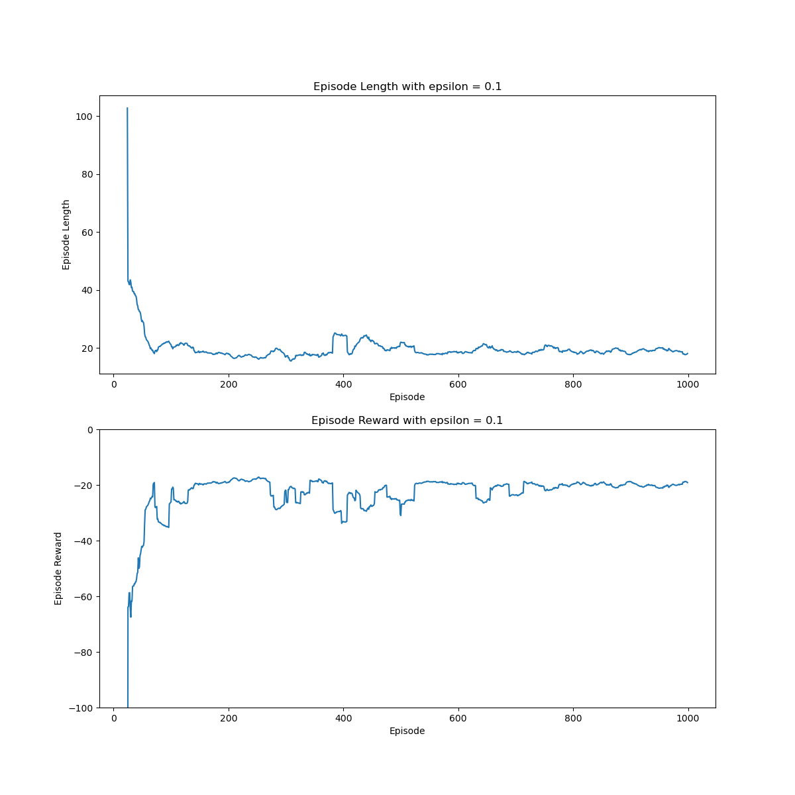

##### Q-learning (random initialization)

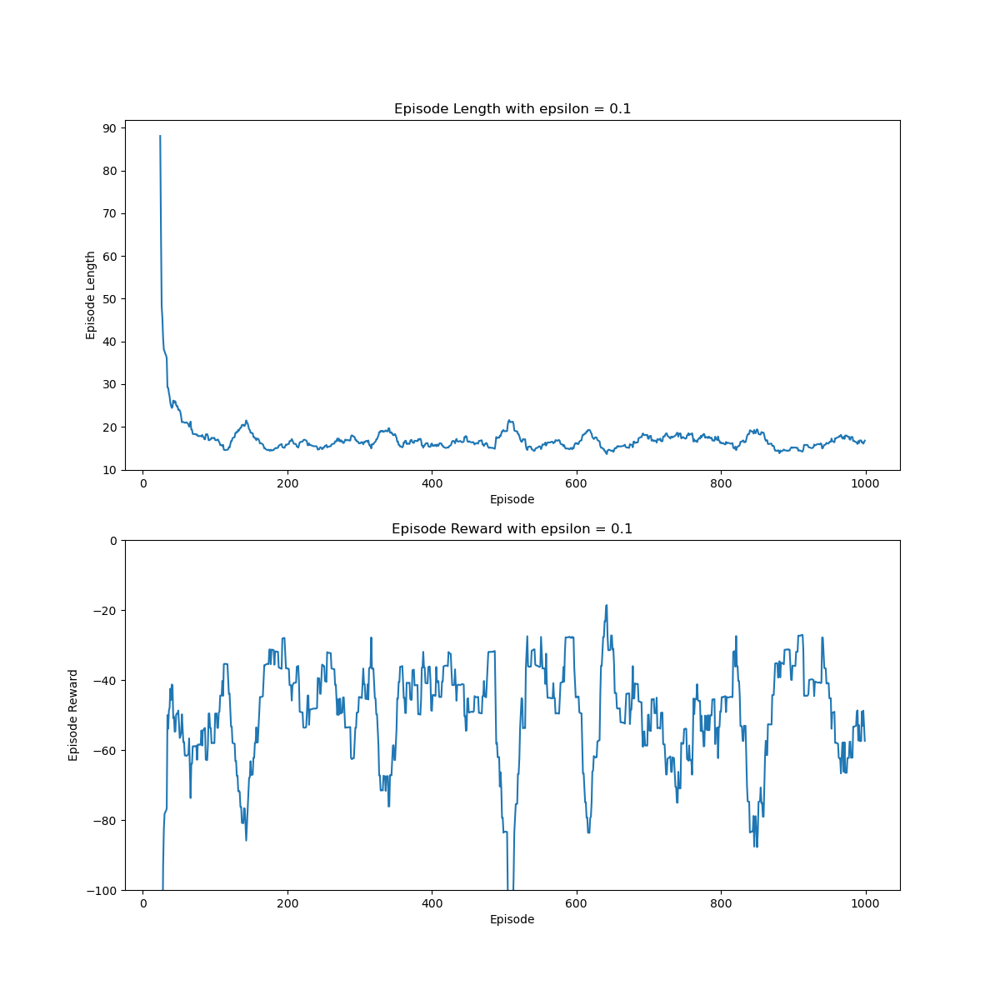

##### Expected Sarsa (random initialization)

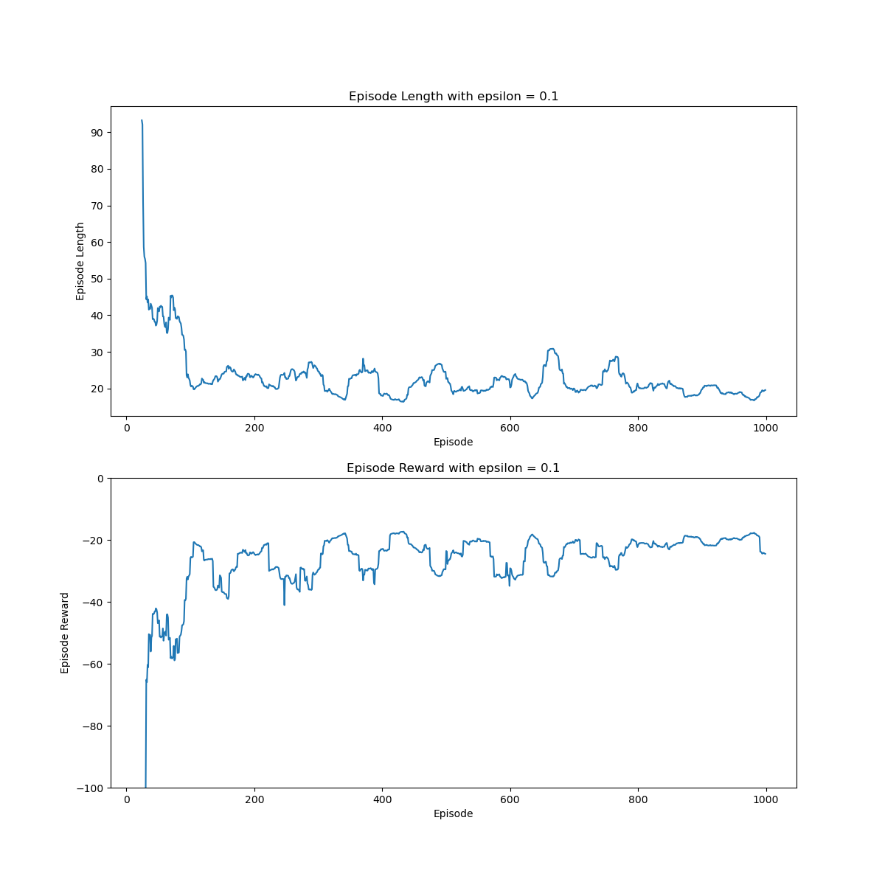

##### Double Q-learning (random initialization)

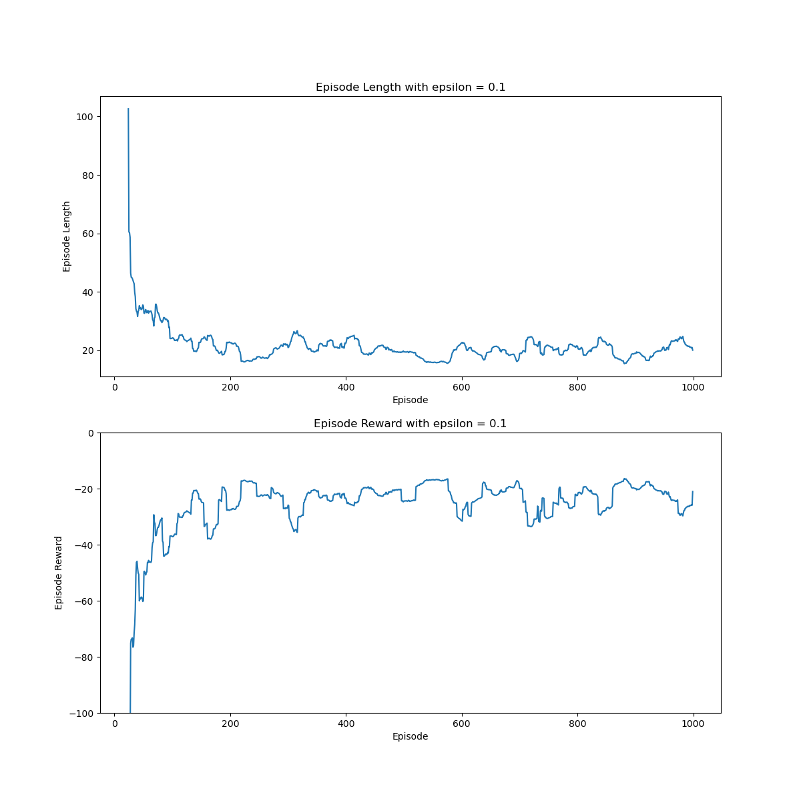

##### Sarsa (zero initialization)

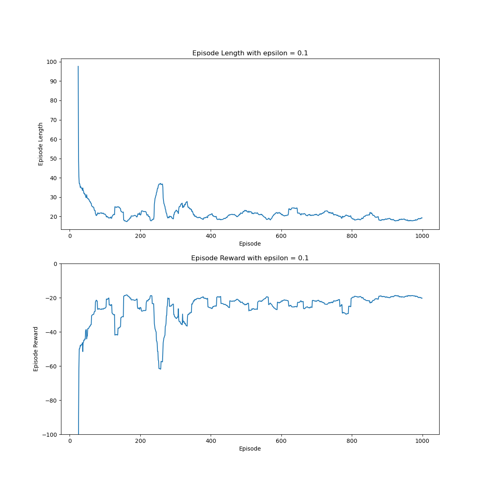

##### Q-learning (zero initialization)

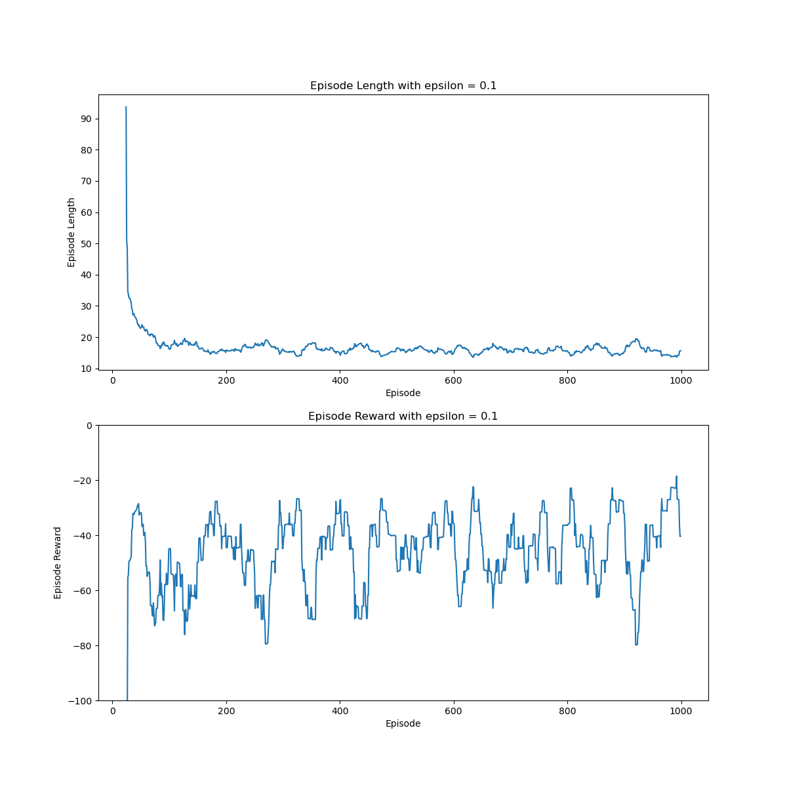

##### Expected Sarsa (zero initialization)

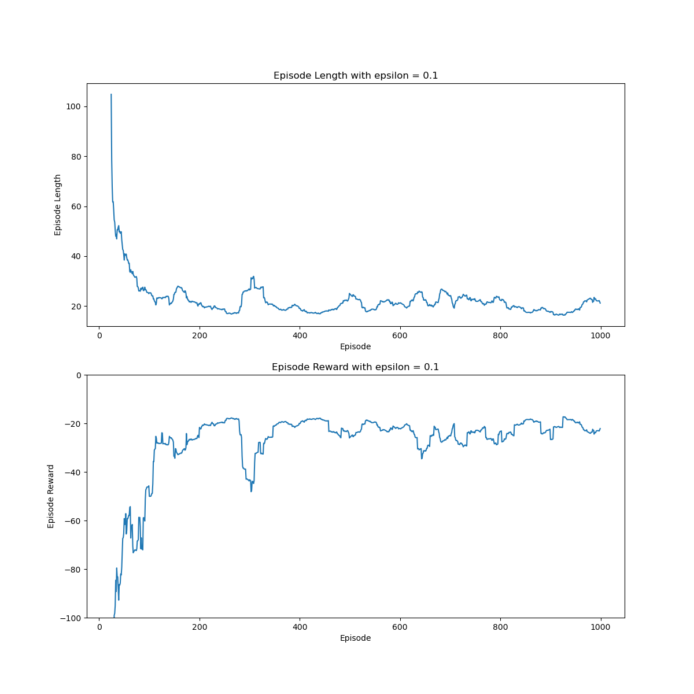

##### Double Q-learning (zero initialization)

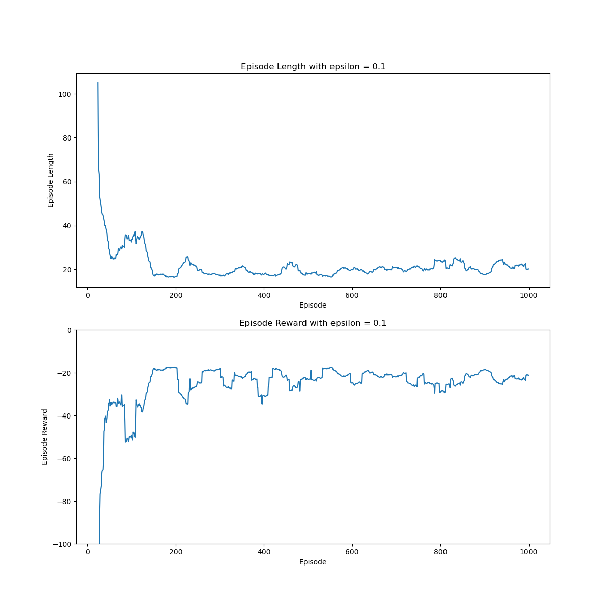

## N-step Bootstrapping

### N-step TD with various number of steps and 10000 episodes/trajectories and $alpha$/learning rate of .01

##### Note: The DP value prediction (above) was:

```
[  0.         -13.99893866 -19.99842728 -21.99824003
 -13.99893866 -17.99861452 -19.9984378  -19.99842728
 -19.99842728 -19.9984378  -17.99861452 -13.99893866
 -21.99824003 -19.99842728 -13.99893866   0.        ]
```

##### Number of steps: 1

```
[  0.         -13.61647404 -21.27529566 -22.77972776
 -14.5951557  -18.41894605 -20.9146111  -20.8680345
 -20.57054541 -20.87555118 -18.89558405 -13.86993279
 -22.88683341 -20.68751343 -15.42854828   0.        ]
```

##### Number of steps: 2

```
[  0.         -15.72173085 -21.45291286 -22.26933487
 -14.67941668 -19.67500739 -20.35644268 -20.34054834
 -21.62993714 -21.05126208 -19.66980134 -13.97418225
 -23.70263438 -21.6856535  -14.88551758   0.        ]
```

##### Number of steps: 3

```
[  0.         -13.13290218 -18.56907749 -22.16853224
 -15.60259317 -19.21207319 -19.72350417 -19.73564529
 -20.47149716 -20.75632715 -17.53075765 -13.14512975
 -21.74668122 -20.52911551 -13.59450666   0.        ]
```

##### Number of steps: 4

```
[  0.         -14.43688617 -19.55150639 -21.99895385
 -12.76049195 -18.46144965 -19.18765952 -18.47668562
 -18.36518538 -19.11563478 -16.64993949 -12.62098607
 -21.33017527 -19.92797704 -13.76613128   0.        ]
```

##### Number of steps: 5

```
[  0.         -15.99078769 -21.10897187 -22.61891676
 -16.65027204 -19.75054629 -21.36658375 -20.69066008
 -21.85730119 -21.11749174 -19.39249969 -15.64321577
 -23.48747273 -20.81374373 -15.7023837    0.        ]
```

##### Number of steps: 10

```
[  0.         -11.71741429 -19.0816727  -21.15028856
 -12.99867986 -15.62524726 -18.75612336 -19.56560246
 -19.86457953 -17.3148007  -14.83946421 -13.79689322
 -21.02796367 -19.13409828 -11.83802525   0.        ]
```

### N-step On-policy Sarsa with various number of steps

#### 50000 episodes/trajectories, $\alpha$/learning rate of .01, and $\epsilon = 0.1$

##### Number of steps: 1

```
[[ 0.          0.          0.          0.        ]
 [-1.         -2.09223946 -3.14639634 -3.13964081]
 [-2.11839069 -2.96717117 -3.73932454 -3.777827  ]
 [-3.26182641 -3.67860207 -3.66516089 -3.17835696]
 [-2.0424202  -1.         -3.0570694  -3.07340136]
 [-2.12062754 -2.20265225 -3.60449682 -3.64990865]
 [-3.2142086  -3.23328749 -3.20753449 -3.21984525]
 [-3.67680482 -3.75265426 -2.92508213 -2.1217643 ]
 [-3.01618372 -2.1170177  -3.76031136 -3.82459084]
 [-3.23261296 -3.21820673 -3.21140254 -3.19384433]
 [-3.59615758 -3.73020466 -2.15635596 -2.18985836]
 [-3.09924141 -3.06591428 -2.04541834 -1.        ]
 [-3.6185706  -3.22732476 -3.26653451 -3.68890617]
 [-3.75522807 -3.61918638 -2.14275408 -2.92577378]
 [-3.09568857 -3.12052763 -1.         -2.08776898]
 [ 0.          0.          0.          0.        ]]
```

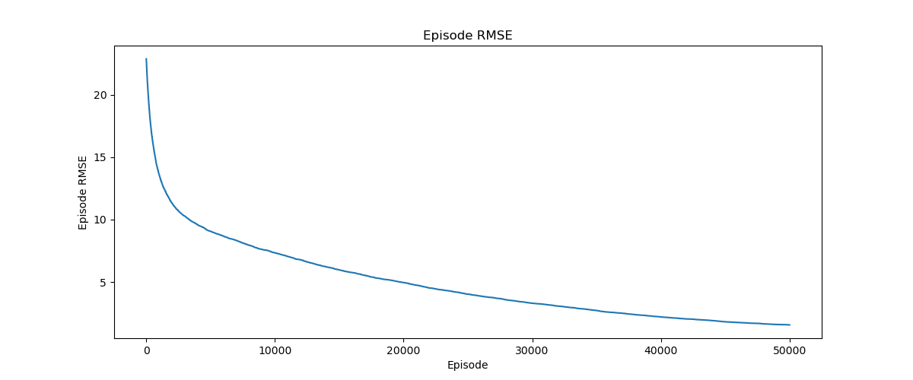

##### Number of steps: 2

```
[[ 0.          0.          0.          0.        ]
 [-1.         -2.07693145 -3.31102641 -3.19002828]
 [-2.1552263  -3.07809325 -3.90321741 -3.97189549]
 [-3.26347488 -3.71540572 -3.82894946 -3.3481006 ]
 [-2.09987381 -1.         -3.16538478 -3.1440089 ]
 [-2.19819188 -2.14577119 -3.68643016 -3.74455775]
 [-3.29860555 -3.32357756 -3.31299994 -3.28278239]
 [-3.79223522 -3.81849306 -3.07464953 -2.08848708]
 [-2.98955987 -2.16416082 -3.71987714 -3.81768747]
 [-3.32350724 -3.32369451 -3.19257438 -3.30542668]
 [-3.78399537 -3.82727964 -2.24618138 -2.12951429]
 [-3.15439157 -3.08110948 -2.12246182 -1.        ]
 [-3.86748793 -3.21726735 -3.36847207 -3.71321868]
 [-3.94195701 -3.81299523 -2.13610307 -3.07817369]
 [-3.21440924 -3.18351493 -1.         -2.08044798]
 [ 0.          0.          0.          0.        ]]
```

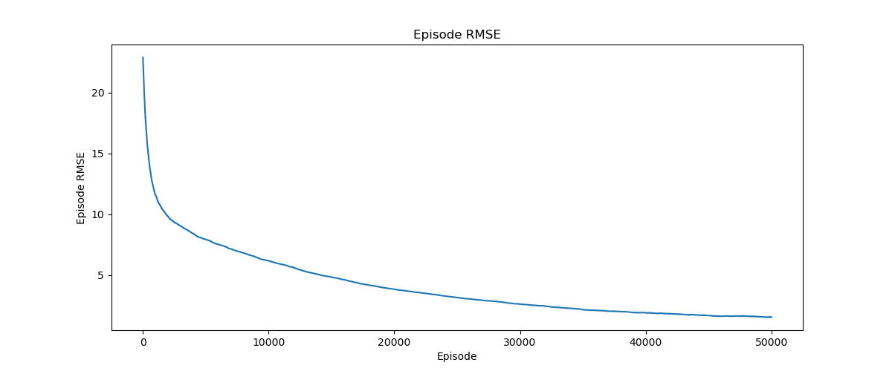

##### Number of steps: 3

```
[[ 0.          0.          0.          0.        ]
 [-1.         -2.10384972 -3.11006972 -3.03528136]
 [-2.16823302 -2.98801305 -3.75383442 -3.80716863]
 [-3.37375599 -3.74596059 -3.90093453 -3.25095929]
 [-2.06084661 -1.         -3.1065261  -3.19109361]
 [-2.14350213 -2.21940839 -3.73323543 -3.72489194]
 [-3.34608195 -3.34745947 -3.27603953 -3.11095241]
 [-3.84652469 -3.85018504 -3.11008828 -2.12011941]
 [-2.91747921 -2.19087733 -3.84739549 -3.7971049 ]
 [-3.35766809 -3.31969712 -3.23650764 -3.36106529]
 [-3.74948637 -3.79770476 -2.07469949 -2.18250222]
 [-3.20609276 -3.19536429 -2.11272453 -1.        ]
 [-3.96017815 -3.38596337 -3.26197862 -3.98567893]
 [-3.96606079 -3.88152007 -2.08837689 -2.98109717]
 [-3.20984676 -3.08104116 -1.         -2.0999215 ]
 [ 0.          0.          0.          0.        ]]
```


##### Number of steps: 4

```
[[ 0.          0.          0.          0.        ]
 [-1.         -2.13855974 -3.25572784 -3.12073748]
 [-2.10397871 -3.11836033 -4.02916612 -3.91838757]
 [-3.16375293 -3.86269332 -3.86959194 -3.40254637]
 [-2.12748826 -1.         -3.17336603 -3.15165515]
 [-2.22437541 -2.14221028 -3.89798745 -3.87513192]
 [-3.32891094 -3.33344032 -3.35269384 -3.3193494 ]
 [-3.63190762 -3.72388036 -2.94086034 -2.07303448]
 [-3.2260632  -2.12872442 -3.97202627 -4.02549071]
 [-3.29383078 -3.3503926  -3.32424736 -3.32850888]
 [-3.73959637 -3.839795   -2.16909402 -2.25143012]
 [-3.11079369 -3.12681335 -2.07623797 -1.        ]
 [-4.06128538 -3.2717532  -3.39054252 -3.97231248]
 [-3.97539377 -3.88766215 -2.12515574 -2.97674468]
 [-3.17703323 -3.19048426 -1.         -2.06915997]
 [ 0.          0.          0.          0.        ]]
```

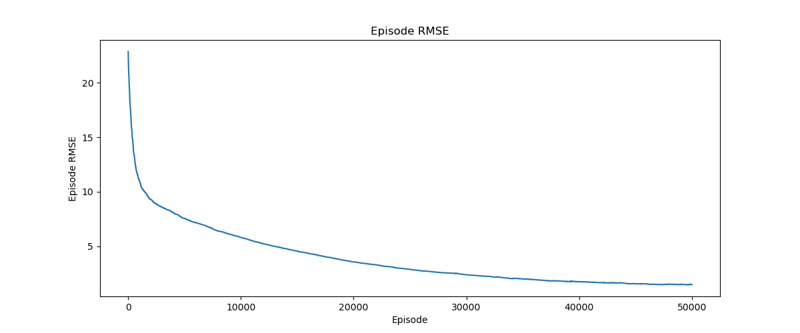

##### Number of steps: 5

```
[[ 0.          0.          0.          0.        ]
 [-1.         -1.99345921 -3.17351174 -3.1158215 ]
 [-2.11647167 -3.05303459 -3.79244748 -3.77789697]
 [-3.40018421 -3.98585818 -3.92072555 -3.29694095]
 [-2.07514376 -1.         -3.13648006 -3.26991832]
 [-2.15674568 -2.21019072 -3.85604219 -3.90785512]
 [-3.27879252 -3.36833756 -3.35955763 -3.3246467 ]
 [-3.88320753 -4.0800491  -3.05156511 -2.13759485]
 [-3.06658225 -2.12239219 -3.84432228 -3.93392933]
 [-3.31019774 -3.19418743 -3.25875694 -3.26264957]
 [-3.76564943 -3.65412545 -2.24351108 -2.13322479]
 [-3.22127922 -3.18175304 -2.13087947 -1.        ]
 [-3.86593557 -3.25576881 -3.42467753 -3.94905621]
 [-3.73647551 -3.86245381 -2.14170611 -3.05455435]
 [-3.24367681 -3.09752434 -1.         -2.08732952]
 [ 0.          0.          0.          0.        ]]
```

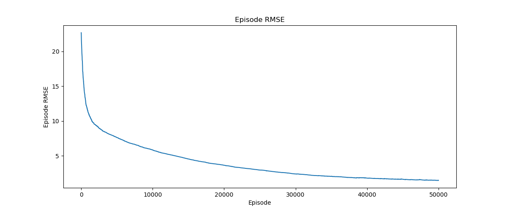

##### Number of steps: 10

```
[[ 0.          0.          0.          0.        ]
 [-1.         -2.08074014 -3.16722326 -3.1771874 ]
 [-2.11044939 -3.19995207 -4.01559304 -3.94801747]
 [-3.21415236 -3.95697579 -4.02714021 -3.33359138]
 [-2.15847927 -1.         -3.16317648 -3.16354476]
 [-2.16840346 -2.2426982  -3.7609613  -3.96219268]
 [-3.34963355 -3.3164552  -3.35524325 -3.33321924]
 [-3.59208249 -3.91270152 -3.07392417 -2.13964116]
 [-3.01467651 -2.12449789 -3.76630015 -3.9303335 ]
 [-3.35730682 -3.35316719 -3.27957571 -3.34019279]
 [-3.77310213 -3.7430052  -2.14565622 -2.24412116]
 [-3.15674087 -3.28075628 -2.06981483 -1.        ]
 [-4.14146445 -3.46254388 -3.30673608 -4.09197358]
 [-4.12484851 -4.00063743 -2.20223263 -3.11799667]
 [-3.25614106 -3.13922746 -1.         -2.07575003]]
```

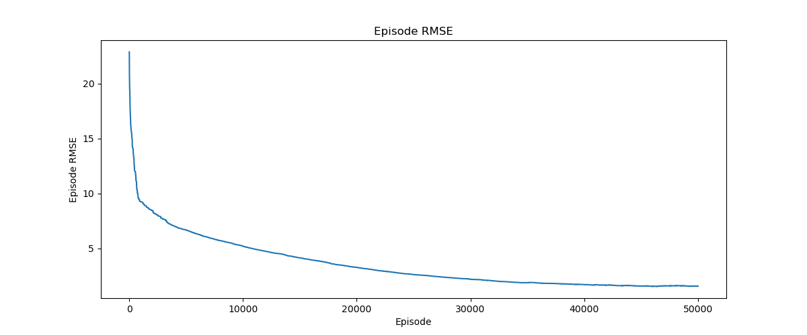

### N-step Tree Backup with various number of steps

#### 100000 episodes/trajectories, $\alpha$/learning rate of .005

##### Number of steps: 1

```
[[ 0.          0.          0.          0.        ]
 [-1.         -1.00792245 -1.00519379 -1.00890793]
 [-2.         -2.00086764 -2.0082912  -2.0051437 ]
 [-2.99999997 -3.00956608 -3.00460026 -2.99999997]
 [-1.00783403 -1.         -1.00089909 -1.00762161]
 [-2.         -2.         -2.00225451 -2.00521848]
 [-2.99980746 -2.99980681 -2.99980701 -2.99980687]
 [-2.00291383 -2.00440011 -2.00093589 -2.        ]
 [-2.00587505 -2.         -2.00632243 -2.00752458]
 [-2.99979223 -2.99979309 -2.99979227 -2.99979258]
 [-2.00371777 -2.00122789 -2.         -2.        ]
 [-1.00631229 -1.00315684 -1.00782943 -1.        ]
 [-3.00427868 -2.99999998 -2.99999998 -3.00927154]
 [-2.00478517 -2.0009265  -2.         -2.00616097]
 [-1.0076662  -1.00178217 -1.         -1.00294763]
 [ 0.          0.          0.          0.        ]]
```

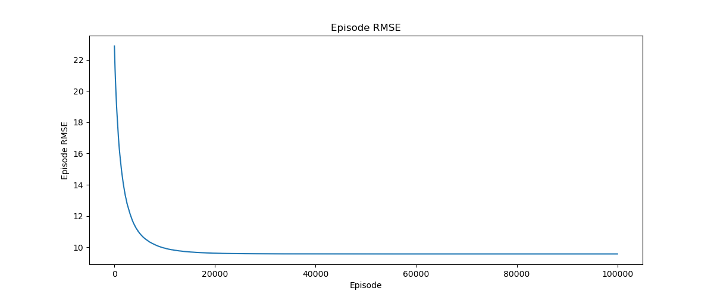

##### Number of steps: 2

```
[[ 0.          0.          0.          0.        ]
 [-1.         -1.03775412 -1.01961356 -1.03935313]
 [-3.         -3.01466074 -3.0233631  -3.02510149]
 [-4.99999995 -5.03218717 -5.03612245 -4.99999995]
 [-1.0225192  -1.         -1.02036509 -1.03910179]
 [-3.         -3.         -3.02646988 -3.01167429]
 [-4.99969901 -4.99969982 -4.99969883 -4.99969885]
 [-3.002634   -3.02907333 -3.01163746 -3.        ]
 [-3.05277782 -3.         -3.01474788 -3.01613392]
 [-4.9997199  -4.99971913 -4.99971967 -4.99971972]
 [-3.00000132 -3.02252215 -3.         -3.        ]
 [-1.01478844 -1.00704639 -1.04118795 -1.        ]
 [-5.00299088 -4.99999997 -4.99999997 -5.05511998]
 [-3.0227018  -3.00969163 -3.         -3.04661117]
 [-1.02453319 -1.02712254 -1.         -1.03241775]
 [ 0.          0.          0.          0.        ]]
```

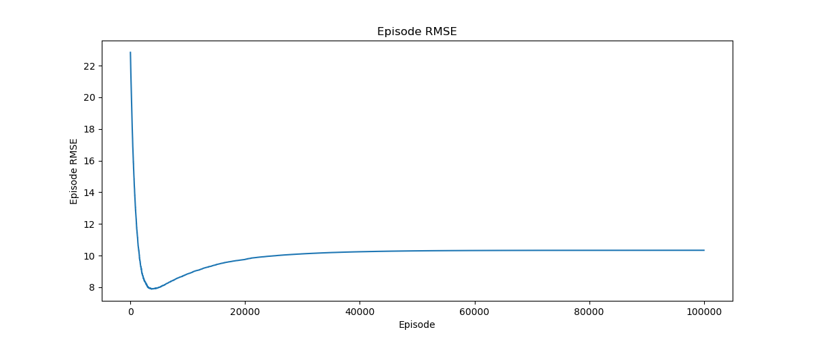

##### Number of steps: 3

```
[[ 0.          0.          0.          0.        ]
 [-1.         -1.02299368 -1.05065355 -1.00510831]
 [-3.         -3.0463357  -3.12115393 -3.00803436]
 [-6.99999992 -7.01326206 -7.12956755 -6.99999992]
 [-1.02376088 -1.         -1.08606111 -1.01057528]
 [-3.         -3.         -3.14164381 -3.01982415]
 [-6.99944097 -6.99944147 -6.99944006 -6.99944068]
 [-3.00718106 -3.09321257 -3.02552982 -3.        ]
 [-3.11068431 -3.         -3.03722599 -3.0065542 ]
 [-6.99948524 -6.99948544 -6.99948585 -6.99948563]
 [-3.14751399 -3.0297986  -3.         -3.        ]
 [-1.01529787 -1.03812557 -1.05457051 -1.        ]
 [-7.02384267 -6.99999994 -6.99999994 -7.21000984]
 [-3.06028955 -3.048292   -3.         -3.14850842]
 [-1.11514689 -1.06442822 -1.         -1.06073821]
 [ 0.          0.          0.          0.        ]]
```

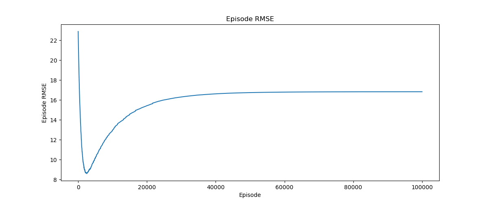

##### Number of steps: 4

```
[[ 0.          0.          0.          0.        ]
 [-1.         -1.1972351  -1.28360476 -1.0212765 ]
 [-3.         -3.23904821 -3.12567526 -3.08015636]
 [-6.99999997 -7.60032061 -7.10890748 -6.99999997]
 [-1.06439383 -1.         -1.02215885 -1.32571226]
 [-3.         -3.         -3.05178277 -3.16907781]
 [-6.99959405 -6.9995951  -6.99959376 -6.99959481]
 [-3.14928984 -3.19995989 -3.10365551 -3.        ]
 [-3.48321429 -3.         -3.04811893 -3.10653801]
 [-6.99947244 -6.99947252 -6.99947369 -6.99947464]
 [-3.22810046 -3.04794718 -3.         -3.        ]
 [-1.11449752 -1.21998647 -1.03788111 -1.        ]
 [-7.62139462 -6.99999994 -6.99999994 -7.57105716]
 [-3.14941299 -3.0478868  -3.         -3.12508286]
 [-1.1292082  -1.02075891 -1.         -1.0710308 ]
 [ 0.          0.          0.          0.        ]]
```

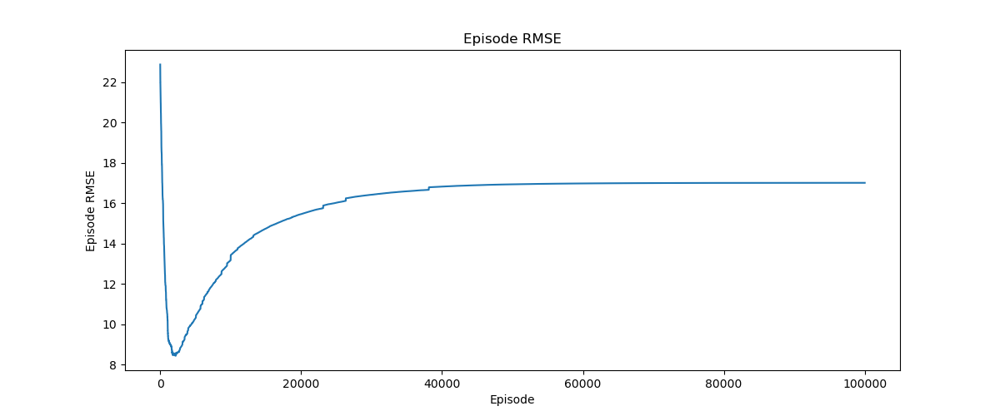

##### Number of steps: 5

```
[[ 0.          0.          0.          0.        ]
 [-1.         -1.32965889 -1.59110504 -1.21914323]
 [-3.         -4.19466227 -3.7437174  -3.30423912]
 [-6.99999994 -7.10191962 -7.86474336 -6.99999994]
 [-1.35225093 -1.         -1.33066764 -1.06726677]
 [-3.         -3.         -3.20417266 -3.41747215]
 [-6.99953016 -6.99953001 -6.99953018 -6.99952996]
 [-3.2824668  -3.1165837  -3.21617562 -3.        ]
 [-3.29006384 -3.         -3.4863806  -3.50669112]
 [-6.99947274 -6.99947078 -6.99947286 -6.99947123]
 [-3.33578016 -3.0579339  -3.         -3.        ]
 [-1.14535946 -1.19330109 -1.2932184  -1.        ]
 [-7.47681899 -6.99999996 -6.99999996 -7.33589207]
 [-3.48279429 -3.25441125 -3.         -3.78933738]
 [-1.45792499 -1.37404431 -1.         -1.23443015]
 [  0.         0.          0.          0.        ]]
```

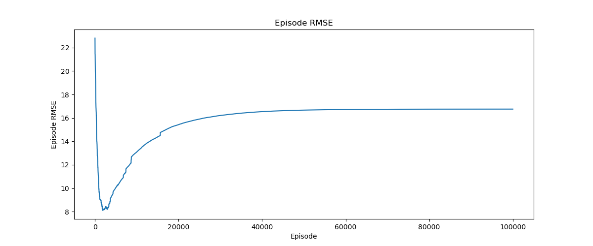

##### Number of steps: 10

```
[[  0.           0.           0.           0.        ]
 [ -1.          -7.37274667  -1.13933316  -7.17193628]
 [ -3.         -25.14837119 -11.64288308 -11.6487439 ]
 [-21.32273054 -33.97442795 -15.67021374  -7.        ]
 [ -5.29315933  -1.          -7.90275497  -8.84400676]
 [-11.48707402  -3.          -5.225175    -7.84666462]
 [ -7.          -7.38755645 -20.36992897 -11.37326156]
 [ -7.89381355 -20.50015287 -20.6326685   -3.        ]
 [-17.58634795  -3.         -12.57229269  -6.64935   ]
 [ -6.99998703  -6.99998709  -9.22723309  -6.99998707]
 [ -7.65752952 -19.29193895 -24.83000268  -3.        ]
 [ -2.50242909  -1.14667293  -5.544566    -1.        ]
 [ -7.47131622  -6.9999999   -6.9999999   -7.24767651]
 [ -9.98666489 -26.48072709  -3.         -28.90848466]
 [ -1.80405849  -6.13191797  -1.          -5.25715848]
 [  0.           0.           0.           0.        ]]
```

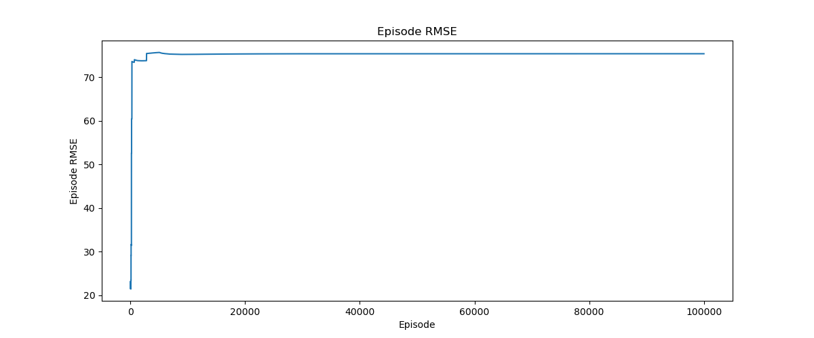

### N-step Off-policy Sarsa with various number of steps

#### $\alpha$/learning rate of .001

##### Number of steps: 1, number of episodes: 1000000

```
[[  0.           0.           0.           0.        ]
 [ -1.         -14.88324487 -20.88251911 -18.83537065]
 [-14.61274122 -20.89897281 -23.03051677 -20.95771635]
 [-20.91359765 -23.01377291 -23.01541676 -21.00920742]
 [-15.22236195  -1.         -18.94082109 -20.91494446]
 [-14.99763017 -15.16796959 -21.00174568 -20.99382671]
 [-18.98757882 -20.89805971 -21.03730158 -18.96871648]
 [-20.94105672 -23.00222856 -21.01861704 -15.222777  ]
 [-21.05010194 -14.98353369 -20.98520223 -23.00808488]
 [-20.88943972 -18.9647653  -18.95705975 -20.92514289]
 [-20.99981508 -20.98831624 -14.97973634 -14.769759  ]
 [-18.94698809 -21.1741697  -14.86075357  -1.        ]
 [-22.99208779 -20.94754783 -20.92348894 -22.96444369]
 [-22.9596371  -20.96205094 -15.06325112 -20.89025787]
 [-20.91090309 -18.86269191  -1.         -15.11668207]
 [  0.           0.           0.           0.        ]]
```

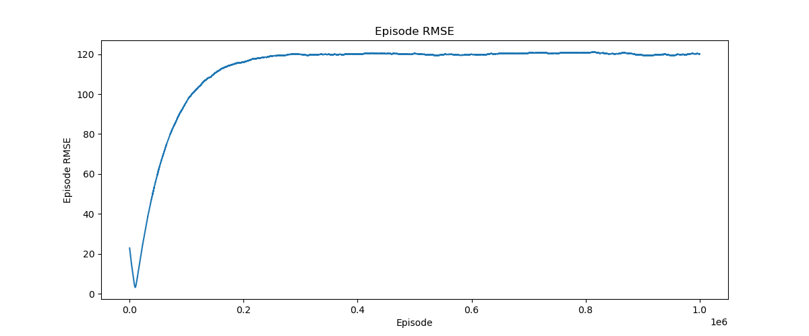

##### Number of steps: 2, number of episodes: 500000

```
[[ 0.          0.          0.          0.        ]
 [-1.         -2.         -5.63691744 -5.66758898]
 [-2.         -5.58216655 -7.41768857 -7.24354598]
 [-5.51175061 -7.53795461 -7.47660553 -5.47815431]
 [-2.         -1.         -5.52490762 -5.4642809 ]
 [-2.         -2.         -7.20919673 -6.25238799]
 [-5.51506519 -5.6140937  -5.55127525 -5.67414725]
 [-7.21512223 -7.37822735 -5.5700707  -2.        ]
 [-5.4262454  -2.         -6.3269612  -7.16850233]
 [-5.58135283 -5.49415486 -5.35124585 -5.6422491 ]
 [-6.38699573 -7.08571404 -2.         -2.        ]
 [-5.46529413 -5.53595422 -2.         -1.        ]
 [-7.28175864 -5.40142693 -5.58954759 -7.30699779]
 [-7.230298   -6.38984379 -2.         -5.57303323]
 [-5.45726094 -5.58583312 -1.         -2.        ]
 [ 0.          0.          0.          0.        ]]
```

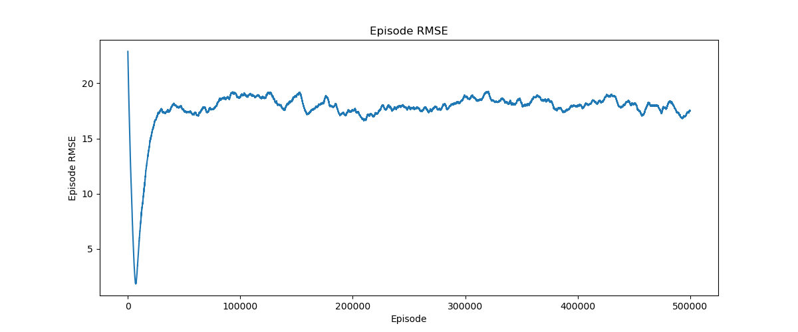

##### Number of steps: 3, number of episodes: 333333

```
[[ 0.          0.          0.          0.        ]
 [-1.         -2.         -3.         -3.        ]
 [-2.         -3.         -5.34355333 -5.21078709]
 [-3.         -5.28933223 -5.30617709 -3.        ]
 [-2.         -1.         -3.         -3.        ]
 [-2.         -2.         -5.34839043 -5.20594441]
 [-3.         -3.         -3.         -3.        ]
 [-5.29830711 -5.06660124 -3.         -2.        ]
 [-3.         -2.         -5.11990537 -5.26962238]
 [-3.         -3.         -3.         -3.        ]
 [-5.12218611 -5.2489604  -2.         -2.        ]
 [-3.         -3.         -2.         -1.        ]
 [-5.05865349 -3.         -3.         -5.19100323]
 [-5.25614296 -5.207731   -2.         -3.        ]
 [-3.         -3.         -1.         -2.        ]
 [ 0.          0.          0.          0.        ]]
```

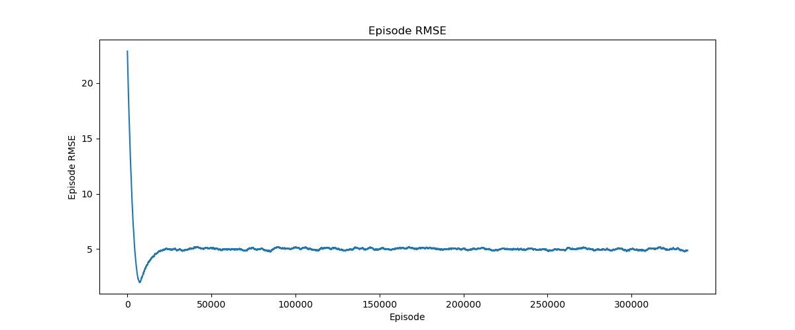

##### Number of steps: 4, number of episodes: 250000

```
[[ 0.  0.  0.  0.]
 [-1. -2. -3. -3.]
 [-2. -3. -4. -4.]
 [-3. -4. -4. -3.]
 [-2. -1. -3. -3.]
 [-2. -2. -4. -4.]
 [-3. -3. -3. -3.]
 [-4. -4. -3. -2.]
 [-3. -2. -4. -4.]
 [-3. -3. -3. -3.]
 [-4. -4. -2. -2.]
 [-3. -3. -2. -1.]
 [-4. -3. -3. -4.]
 [-4. -4. -2. -3.]
 [-3. -3. -1. -2.]
 [ 0.  0.  0.  0.]]
```

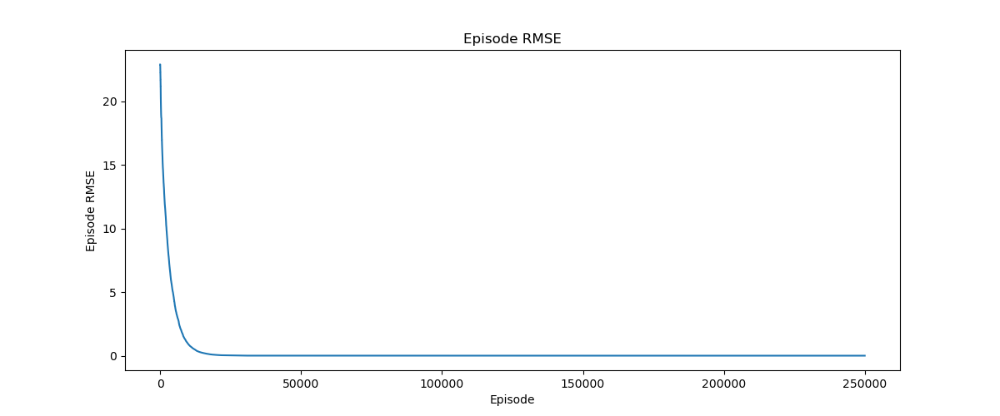

##### Number of steps: 5, number of episodes: 200000

```
[[ 0.  0.  0.  0.]
 [-1. -2. -3. -3.]
 [-2. -3. -4. -4.]
 [-3. -4. -4. -3.]
 [-2. -1. -3. -3.]
 [-2. -2. -4. -4.]
 [-3. -3. -3. -3.]
 [-4. -4. -3. -2.]
 [-3. -2. -4. -4.]
 [-3. -3. -3. -3.]
 [-4. -4. -2. -2.]
 [-3. -3. -2. -1.]
 [-4. -3. -3. -4.]
 [-4. -4. -2. -3.]
 [-3. -3. -1. -2.]
 [ 0.  0.  0.  0.]]
```

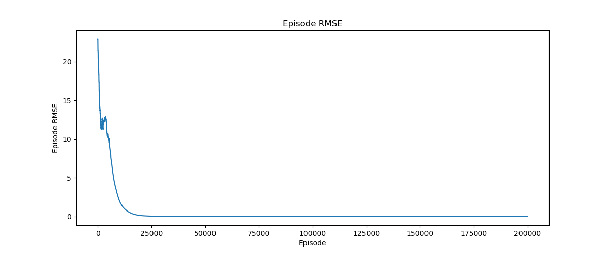

##### Number of steps: 10, number of episodes: 100000

```
[[ 0.00000000e+00  0.00000000e+00  0.00000000e+00  0.00000000e+00]
 [-1.00000000e+00  0.00000000e+00  0.00000000e+00  0.00000000e+00]
 [ 0.00000000e+00  0.00000000e+00  0.00000000e+00  0.00000000e+00]
 [-2.62144000e+03 -2.63402291e+03 -2.62144000e+03  0.00000000e+00]
 [ 0.00000000e+00 -1.00000000e+00  0.00000000e+00  0.00000000e+00]
 [ 0.00000000e+00  0.00000000e+00  0.00000000e+00  0.00000000e+00]
 [-4.80000000e-02  0.00000000e+00  0.00000000e+00  0.00000000e+00]
 [ 0.00000000e+00  0.00000000e+00  0.00000000e+00 -2.62144000e+03]
 [ 6.81951887e+05  0.00000000e+00  0.00000000e+00  0.00000000e+00]
 [ 0.00000000e+00  0.00000000e+00  0.00000000e+00  0.00000000e+00]
 [ 0.00000000e+00  0.00000000e+00  0.00000000e+00  0.00000000e+00]
 [ 0.00000000e+00  0.00000000e+00  0.00000000e+00 -1.00000000e+00]
 [ 0.00000000e+00  0.00000000e+00 -2.62144000e+03  0.00000000e+00]
 [ 0.00000000e+00  0.00000000e+00  0.00000000e+00  0.00000000e+00]
 [ 0.00000000e+00  0.00000000e+00 -1.00000000e+00  0.00000000e+00]
 [ 0.00000000e+00  0.00000000e+00  0.00000000e+00  0.00000000e+00]]
```

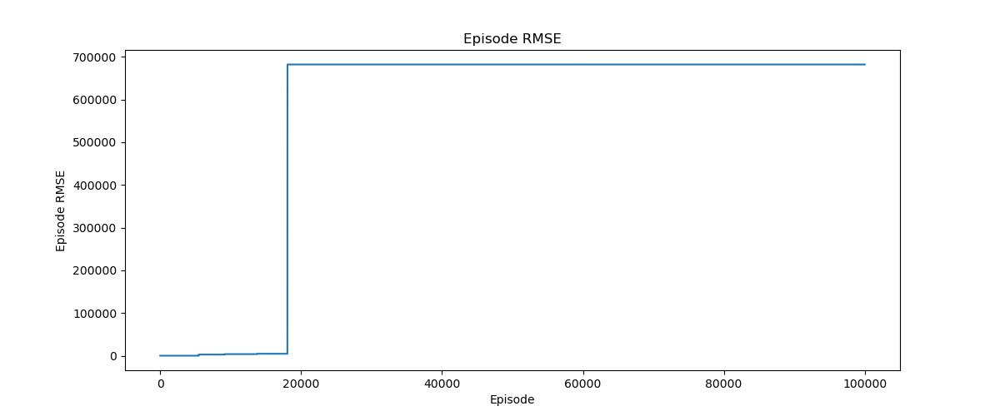
