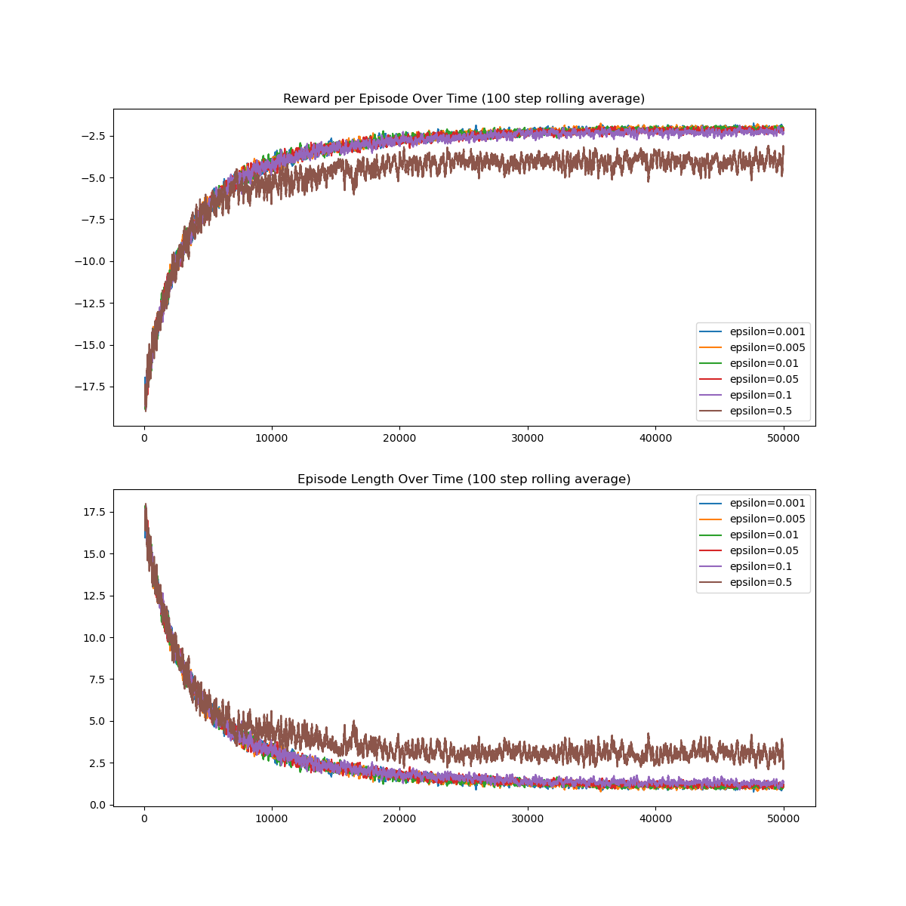
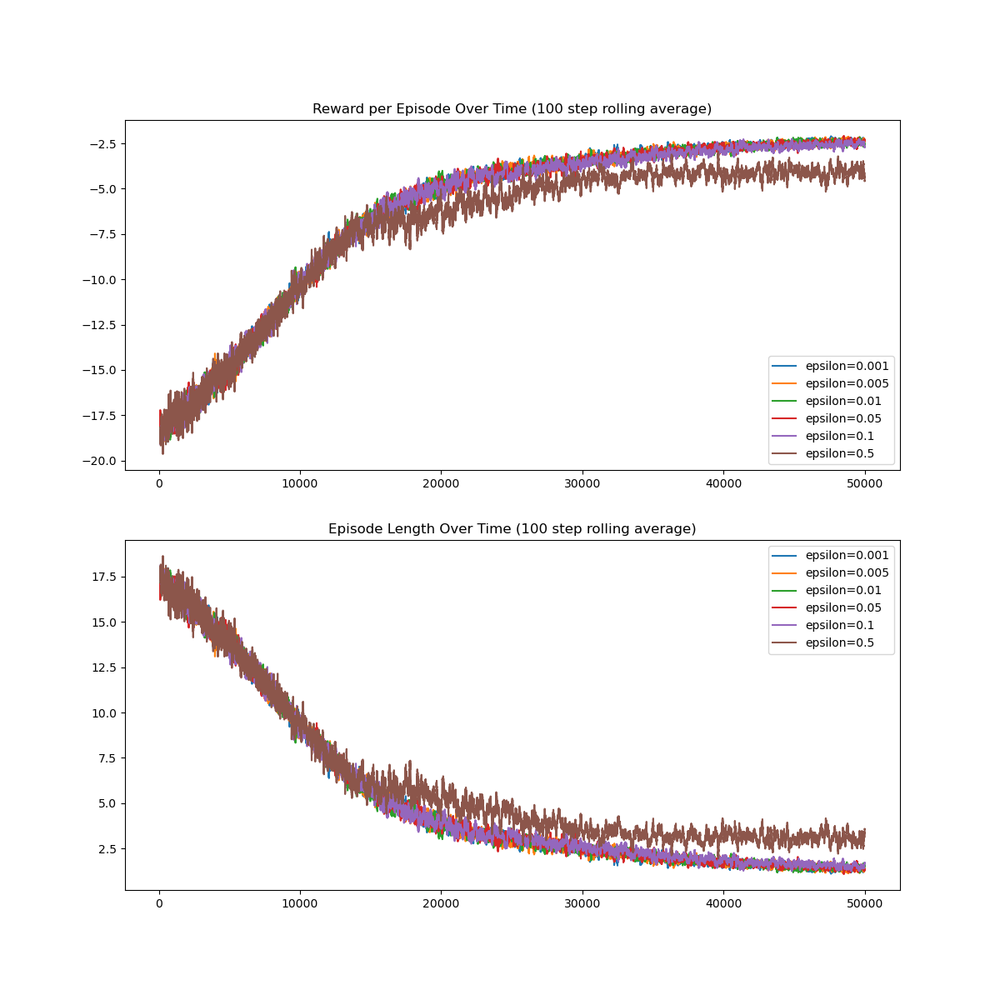
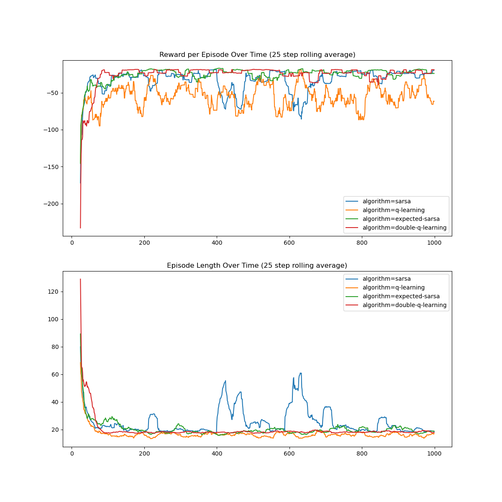

# Reinforcement Learning: An Introduction

These are notes and results from implementations of various examples
and algorithms from throughout the book.

## Chapter 2: Multi-armed Bandits

### K-armed Bandit Testbed Implementation

#### Graphs for basic implementation with various parameters

- 10 arms
- $\epsilon$-greedy values: .1, .05, .01, 0
- averages over 2000 runs
- 1000 steps


- 10 arms
- $\epsilon$-greedy values: .1, .05, .01, 0
- averages over 2000 runs
- 1000 steps
- optimistic initial value of 5
- non-stationary update rule


- 10 arms
- UCB constant values: 1, 2, 5, 10
- averages over 2000 runs
- 1000 steps


## Chapter 4: Dynamic Programming

Note: Unless otherwise noted, all examples used a $4\times4$ deterministic GridWorld MDP.

$\pi_\star$:

```
[ 0 0 0 0
  1 0 0 3
  1 0 2 3
  1 2 2 0]
```

State value prediction using $p_\star$ (above):

```
[ 0. -1. -2. -3.
 -1. -2. -3. -2.
 -2. -3. -2. -1.
 -3. -2. -1.  0.]
```

State-action value prediction using $p_\star$ (above):

```
[[ 0.  0.  0.  0.]
 [-1. -2. -3. -3.]
 [-2. -3. -4. -4.]
 [-3. -4. -4. -3.]
 [-2. -1. -3. -3.]
 [-2. -2. -4. -4.]
 [-3. -3. -3. -3.]
 [-4. -4. -3. -2.]
 [-3. -2. -4. -4.]
 [-3. -3. -3. -3.]
 [-4. -4. -2. -2.]
 [-3. -3. -2. -1.]
 [-4. -3. -3. -4.]
 [-4. -4. -2. -3.]
 [-3. -3. -1. -2.]
 [ 0.  0.  0.  0.]]
 ```

State value prediction using an equiprobable random policy:

```
[  0.         -13.99893866 -19.99842728 -21.99824003
 -13.99893866 -17.99861452 -19.9984378  -19.99842728
 -19.99842728 -19.9984378  -17.99861452 -13.99893866
 -21.99824003 -19.99842728 -13.99893866   0.        ]
 ```

State-action value prediction using an equiprobable random policy:

```
[[  0.           0.           0.           0.        ]
 [ -1.         -14.99887902 -20.99833891 -18.99853668]
 [-14.99887902 -20.99833891 -22.99814115 -20.99835003]
 [-20.99833891 -22.99814115 -22.99814115 -20.99833891]
 [-14.99887902  -1.         -18.99853668 -20.99833891]
 [-14.99887902 -14.99887902 -20.99835003 -20.99835003]
 [-18.99853668 -20.99833891 -20.99833891 -18.99853668]
 [-20.99835003 -22.99814115 -20.99833891 -14.99887902]
 [-20.99833891 -14.99887902 -20.99835003 -22.99814115]
 [-20.99833891 -18.99853668 -18.99853668 -20.99833891]
 [-20.99835003 -20.99835003 -14.99887902 -14.99887902]
 [-18.99853668 -20.99833891 -14.99887902  -1.        ]
 [-22.99814115 -20.99833891 -20.99833891 -22.99814115]
 [-22.99814115 -20.99835003 -14.99887902 -20.99833891]
 [-20.99833891 -18.99853668  -1.         -14.99887902]
 [  0.           0.           0.           0.        ]]
```

## Chapter 5: Monte Carlo Methods

First visit state value prediction using an equiprobable random policy with 100000 trajectories/episodes:

```
[  0.          -4.89446992  -8.28628159 -10.41292918
  -4.90394671  -6.45359771  -7.67281568  -8.25182539
  -8.22930065  -7.65805575  -6.49836474  -4.92075885
  -10.42069993  -8.08775559  -4.86703613  0.]
```

Every visit state value prediction using an equiprobable random policy with 100000 trajectories/episodes:

```
[  0.         -13.89942518 -19.84722623 -21.8641906
 -13.99492976 -17.95387222 -19.86638925 -19.79371526
 -19.80255672 -19.91403795 -17.90539881 -13.91110278
 -21.88796227 -19.92882583 -13.8152689    0.]
```

Policy iteration ($\pi \approx \pi_\star$) with exploring starts from an equiprobable random policy with 100000 trajectories/episodes

```
[0 0 0 3
 1 0 3 3
 1 2 2 3
 1 2 2 0]
 ```

On-policy state-action value prediction with exploring starts from an equiprobable random policy with 100000 trajectories/episodes

```
[[  0.           0.           0.           0.        ]
 [ -1.         -14.78654229 -21.02331045 -18.99832389]
 [-14.888272   -21.01292305 -22.93211709 -21.19819901]
 [-20.97189294 -22.83740889 -22.77129636 -20.88062269]
 [-15.02362072  -1.         -18.96773724 -21.05037401]
 [-14.88742304 -15.03271226 -21.06039434 -21.03715862]
 [-19.04281462 -21.00959366 -21.18797805 -19.04468586]
 [-21.08256389 -22.91684219 -21.00897127 -15.0288286 ]
 [-21.28437903 -15.05760307 -21.07756962 -23.11239939]
 [-21.13327091 -19.01649633 -19.07661973 -21.12922396]
 [-20.98453251 -21.03514459 -15.18223422 -15.23848945]
 [-19.19881265 -20.94675381 -14.99930598  -1.        ]
 [-22.94921231 -21.09683225 -20.99841692 -22.88845156]
 [-22.9758971  -21.21682513 -15.01800612 -20.92207382]
 [-21.00239041 -19.25709616  -1.         -15.12323233]
 [  0.           0.           0.           0.        ]]
```

On-policy action-state value prediction with ordinary importance sampling from an equiprobable random policy with 100000 trajectories/episodes:

```
[[  0.           0.           0.           0.        ]
 [ -1.         -14.93732002 -20.65596439 -18.98024023]
 [-14.92924613 -20.94580603 -22.77849491 -20.8730485 ]
 [-20.93416407 -23.00568907 -23.04810873 -20.9515844 ]
 [-14.74453998  -1.         -19.03368483 -21.10372025]
 [-14.96605794 -14.81492962 -21.16037603 -20.92132003]
 [-18.90889809 -20.92916809 -21.24052264 -18.7621847 ]
 [-21.05174528 -23.04091114 -20.93321441 -15.08745978]
 [-21.08413334 -15.13103614 -20.97836385 -22.95691604]
 [-21.07546343 -18.9160906  -18.97370322 -21.01224361]
 [-20.92686612 -20.90305399 -14.97498954 -14.91383422]
 [-19.10079423 -21.06416769 -14.92774105  -1.        ]
 [-23.09970572 -20.90189895 -21.02428339 -22.91837707]
 [-22.89908644 -21.09541354 -15.13498845 -20.99862444]
 [-21.06629926 -18.9337005   -1.         -14.91102849]
 [  0.           0.           0.           0.        ]]
```

On-policy action-state value prediction with weighted importance sampling from an equiprobable random policy with 100000 trajectories/episodes:

```
[[  0.           0.           0.           0.        ]
 [ -1.         -14.93732002 -20.65596439 -18.98024023]
 [-14.92924613 -20.94580603 -22.77849491 -20.8730485 ]
 [-20.93416407 -23.00568907 -23.04810873 -20.9515844 ]
 [-14.74453998  -1.         -19.03368483 -21.10372025]
 [-14.96605794 -14.81492962 -21.16037603 -20.92132003]
 [-18.90889809 -20.92916809 -21.24052264 -18.7621847 ]
 [-21.05174528 -23.04091114 -20.93321441 -15.08745978]
 [-21.08413334 -15.13103614 -20.97836385 -22.95691604]
 [-21.07546343 -18.9160906  -18.97370322 -21.01224361]
 [-20.92686612 -20.90305399 -14.97498954 -14.91383422]
 [-19.10079423 -21.06416769 -14.92774105  -1.        ]
 [-23.09970572 -20.90189895 -21.02428339 -22.91837707]
 [-22.89908644 -21.09541354 -15.13498845 -20.99862444]
 [-21.06629926 -18.9337005   -1.         -14.91102849]
 [ 0.            0.           0.           0.        ]]
```

For off-policy prediction, the following $p_\star$ was used:

```
[0 0 0 0
 1 0 0 3
 1 0 2 3
 1 2 2 0]
```

Off-policy action-state value prediction with ordinary importance sampling from an optimal evaluation/target policy and an equiprobable random behavior policy with 100000 trajectories/episodes:

```
[[ 0.          0.          0.          0.        ]
 [-1.         -1.9992374  -2.97363796 -2.99999647]
 [-2.00019191 -2.99966621 -4.00683547 -4.04537815]
 [-3.00693474 -4.12674185 -3.99869607 -3.00069339]
 [-2.         -1.         -3.         -3.00075366]
 [-1.9999781  -2.         -3.98122063 -3.99649069]
 [-3.00611111 -3.00075473 -3.00043779 -3.00331997]
 [-4.00229134 -3.99450818 -3.00488347 -1.99987431]
 [-2.99952409 -1.99999014 -4.00056357 -6.74039915]
 [-2.9999996  -3.00001676 -2.99993315 -2.99998889]
 [-3.75728522 -4.642233   -2.00009175 -2.00007735]
 [-3.00607859 -3.00119999 -1.99905125 -1.        ]
 [-4.00821703 -3.00071329 -3.00026275 -4.00481858]
 [-3.9868127  -3.9976738  -1.99996913 -3.00001453]
 [-2.99945503 -3.00811211 -1.         -1.99954542]
 [ 0.          0.          0.          0.        ]]
```

Off-policy action-state value prediction with weighted importance sampling from an optimal evaluation/target policy and an equiprobable random behavior policy with 100000 trajectories/episodes:

```
[[ 0.  0.  0.  0.]
 [-1. -2. -3. -3.]
 [-2. -3. -4. -4.]
 [-3. -4. -4. -3.]
 [-2. -1. -3. -3.]
 [-2. -2. -4. -4.]
 [-3. -3. -3. -3.]
 [-4. -4. -3. -2.]
 [-3. -2. -4. -4.]
 [-3. -3. -3. -3.]
 [-4. -4. -2. -2.]
 [-3. -3. -2. -1.]
 [-4. -3. -3. -4.]
 [-4. -4. -2. -3.]
 [-3. -3. -1. -2.]
 [ 0.  0.  0.  0.]]
```

## Chapter 6: Temporal-Difference Learning

### TD(0) state value prediction

#### Using an equiprobable policy with 100000 trajectories/episodes and various learning rates:

##### Note: The DP value prediction (above) was:

```
[  0.         -13.99893866 -19.99842728 -21.99824003
 -13.99893866 -17.99861452 -19.9984378  -19.99842728
 -19.99842728 -19.9984378  -17.99861452 -13.99893866
 -21.99824003 -19.99842728 -13.99893866   0.        ]
```

##### $\alpha = 0.5$

```
[  0.          -2.70173525 -15.25442049 -16.45102992
 -11.30188452 -20.41052487 -17.75373784 -13.60656717
 -22.94151638 -21.97106395 -22.84258782 -16.68697767
 -23.81630121 -25.84575436 -13.13488785   0.         ]
```

##### $\alpha = 0.1$

```
[  0.         -10.5319724  -17.94771481 -19.6362875
 -16.36309724 -18.8125167  -18.45114487 -16.73061142
 -20.46195277 -19.54320493 -18.33005721 -11.72767014
 -21.61665552 -20.86267014 -17.12954798   0.         ]
```

##### $\alpha = 0.05$

```
[  0.         -12.16656987 -18.51000432 -20.78290447
 -15.99813954 -18.49951441 -19.03747525 -17.90384192
 -20.10394992 -19.30709086 -17.66106697 -11.8386533
 -21.17290604 -19.9500859  -16.24002709   0.         ]
```

##### $\alpha = 0.01$

```
[  0.         -13.861116   -19.61066548 -22.123904
 -14.72782055 -18.28816487 -20.09820822 -19.78313606
 -19.85117358 -19.88409837 -17.90096139 -13.11661615
 -21.70742528 -19.76532052 -14.27491922   0.         ]
```

##### $\alpha = 0.005$

```
[  0.         -13.98955979 -19.87252719 -22.16861455
 -14.37936644 -18.19866906 -20.16362936 -19.96218186
 -19.8608472  -20.0133062  -17.98529914 -13.47264769
 -21.90421344 -19.9955607  -13.99063538   0.         ]
```

##### $\alpha = 0.001$

```
[  0.         -13.79604627 -19.92536304 -22.05476998
 -14.01611566 -18.06073819 -20.04642368 -20.13735546
 -19.8749084  -19.97446076 -17.98030951 -13.96462937
 -21.86890885 -19.99301963 -13.88103261   0.         ]
```

### Sarsa

#### On-policy TD control for estimating $Q \approx q_\star$ with various epsilon:

##### State-action value (Q) prediction using $\epsilon=.5$:

```
[[ 0.          0.          0.          0.        ]
 [-1.         -2.85579243 -4.28485449 -4.13269731]
 [-3.00956776 -4.09304912 -4.76422049 -4.59931168]
 [-4.39263418 -4.51240024 -4.51960408 -4.39092372]
 [-2.93209457 -1.         -4.11411161 -4.27056746]
 [-3.02591282 -2.96331817 -4.6727613  -4.63443842]
 [-4.21525838 -4.22050888 -4.22100734 -4.2208666 ]
 [-4.58287636 -4.78485619 -4.09924071 -3.01257243]
 [-4.04427033 -3.03911478 -4.59148907 -4.75327843]
 [-4.21306234 -4.21208534 -4.2130123  -4.2138793 ]
 [-4.675661   -4.63826364 -2.99898065 -2.96871477]
 [-4.13230127 -4.31150026 -2.97340277 -1.        ]
 [-4.57358644 -4.39532015 -4.39515275 -4.50140208]
 [-4.74126403 -4.57504584 -3.04047554 -4.0973574 ]
 [-4.23853241 -4.12658418 -1.         -2.90006123]
 [ 0.          0.          0.          0.        ]]
```

##### State-action value (Q) prediction using $\epsilon=.1$:

```
[[ 0.          0.          0.          0.        ]
 [-1.         -1.44075838 -1.85418745 -1.86444985]
 [-2.04860997 -2.19309563 -2.40292451 -2.3307237 ]
 [-3.00950097 -3.01073183 -3.01288608 -3.00947867]
 [-1.41709129 -1.         -1.87508149 -1.89295756]
 [-2.82850178 -2.82848407 -2.82839694 -2.82838398]
 [-2.0444345  -2.04374294 -2.21409949 -2.23752127]
 [-2.30759548 -2.37869585 -2.20794007 -2.04875742]
 [-2.20959488 -2.04870222 -2.28337554 -2.35744217]
 [-2.82362782 -2.82353839 -2.82356362 -2.82355108]
 [-2.20750155 -2.19984932 -2.03968329 -2.03546232]
 [-1.84893907 -1.86715947 -1.44761953 -1.        ]
 [-3.00687484 -3.00234566 -3.00265934 -3.00662555]
 [-2.34852736 -2.33671022 -2.04556875 -2.20294441]
 [-1.86015548 -1.77914141 -1.         -1.46345584]
 [ 0.          0.          0.          0.        ]]
```

##### State-action value (Q) prediction using $\epsilon=.01$:

```
[[ 0.          0.          0.          0.        ]
 [-1.         -1.05219118 -1.09701934 -1.08333864]
 [-2.00057832 -2.01705916 -2.04054698 -2.01354299]
 [-2.95105283 -2.95275922 -2.95190935 -2.95102548]
 [-1.04741475 -1.         -1.07053364 -1.09885181]
 [-1.99584027 -1.99584009 -2.00596767 -2.00398011]
 [-2.75897126 -2.75912093 -2.75916341 -2.75908268]
 [-2.02597595 -2.02960437 -2.01309452 -2.00033641]
 [-2.01108545 -2.00026565 -2.01691831 -2.02444159]
 [-2.75667742 -2.75685183 -2.75673098 -2.75688731]
 [-1.9982705  -1.99718056 -1.99600097 -1.99600452]
 [-1.09012752 -1.09264496 -1.04360117 -1.        ]
 [-2.9547494  -2.95213386 -2.9521028  -2.95390802]
 [-2.02377139 -2.02264749 -2.00046187 -2.01211259]
 [-1.09214688 -1.09871427 -1.         -1.04375926]
 [ 0.          0.          0.          0.        ]]

```

##### State-action value (Q) prediction using $\epsilon=.001$:

```
[[ 0.          0.          0.          0.        ]
 [-1.         -1.00556555 -1.00503066 -1.00478825]
 [-1.99999176 -2.00317096 -2.01032198 -2.00041957]
 [-2.9509094  -2.95277756 -2.95191058 -2.95090705]
 [-1.00655999 -1.         -1.00104399 -1.00944647]
 [-1.99523246 -1.99523164 -1.99582013 -1.99627803]
 [-2.74885633 -2.74883778 -2.74893759 -2.74900141]
 [-2.00092226 -2.00393685 -2.00215429 -1.99999135]
 [-2.00318752 -1.99999189 -2.0031933  -2.00316631]
 [-2.75249937 -2.75256671 -2.75247554 -2.7525095 ]
 [-1.99619041 -1.99560225 -1.99485197 -1.99484811]
 [-1.01019385 -1.00932386 -1.00854635 -1.        ]
 [-2.95375673 -2.95206117 -2.95205768 -2.95291648]
 [-2.0004788  -2.00606434 -1.99999505 -2.00520259]
 [-1.01967701 -1.01211184 -1.         -1.00755733]
 [ 0.          0.          0.          0.        ]]
```



### Q-learning

#### Off-policy TD control for estimating $Q \approx q_\star$ with various epsilon:

##### State-action value (Q) prediction using $\epsilon=.5$:

```
[[ 0.          0.          0.          0.        ]
 [-1.         -1.98625243 -2.97437716 -2.97236186]
 [-1.99999988 -2.92901453 -3.81728516 -3.77704648]
 [-2.99687306 -3.68833769 -3.68117151 -2.99688055]
 [-1.98790102 -1.         -2.97064277 -2.97827815]
 [-1.99994383 -1.99994385 -3.77018836 -3.76444719]
 [-2.98323279 -2.98322065 -2.98322689 -2.98323345]
 [-3.77106852 -3.84072161 -2.93959214 -1.99999989]
 [-2.93809404 -1.99999988 -3.77897863 -3.83427002]
 [-2.98357971 -2.98359808 -2.98358642 -2.98357335]
 [-3.77354842 -3.77572225 -1.99995054 -1.99995054]
 [-2.97490587 -2.97875    -1.98937924 -1.        ]
 [-3.66912612 -2.99678245 -2.99678477 -3.67213141]
 [-3.8245369  -3.77454327 -1.99999987 -2.92648411]
 [-2.97503587 -2.97343465 -1.         -1.9886251 ]]
 [ 0.          0.          0.          0.        ]]
```

##### State-action value (Q) prediction using $\epsilon=.1$:

```
[[ 0.          0.          0.          0.        ]
 [-1.         -1.4326501  -1.85837293 -1.8581693 ]
 [-1.99999446 -2.19382123 -2.3785333  -2.3142093 ]
 [-2.95958628 -2.96272783 -2.96872483 -2.95955479]
 [-1.41119487 -1.         -1.83989203 -1.85407823]
 [-1.99729402 -1.99729376 -2.21268019 -2.20641504]
 [-2.78941242 -2.78947949 -2.78947532 -2.78943787]
 [-2.28985527 -2.32382783 -2.1872774  -1.99999454]
 [-2.20333341 -1.99999456 -2.31505121 -2.32086117]
 [-2.79876576 -2.79882229 -2.7989298  -2.79885613]
 [-2.22528164 -2.22273502 -1.99737438 -1.99737431]
 [-1.84958363 -1.87041617 -1.42632271 -1.        ]
 [-2.96766625 -2.96089153 -2.96091181 -2.96480193]
 [-2.35149278 -2.32528579 -1.99999466 -2.17935586]
 [-1.84416544 -1.88528071 -1.         -1.42289518]]
 [ 0.          0.          0.          0.        ]]
```

##### State-action value (Q) prediction using $\epsilon=.01$:

```
[[ 0.          0.          0.          0.        ]
 [-1.         -1.04973347 -1.07904408 -1.079474  ]
 [-1.99999001 -2.00894008 -2.03393966 -2.02308546]
 [-2.94904271 -2.94997939 -2.94999006 -2.94908212]
 [-1.04878188 -1.         -1.11190282 -1.10026831]
 [-1.99547562 -1.99547931 -1.99793475 -2.00336582]
 [-2.75431817 -2.7542419  -2.75430764 -2.75426879]
 [-2.01916583 -2.02268316 -2.01487421 -1.99999137]
 [-2.00993953 -1.99999081 -2.01713837 -2.04750181]
 [-2.75562722 -2.75542672 -2.75560986 -2.75551488]
 [-2.00393828 -1.99881435 -1.99540765 -1.99540668]
 [-1.0923539  -1.10013737 -1.03921795 -1.        ]
 [-2.94897714 -2.94806445 -2.94804111 -2.94898673]
 [-2.03227505 -2.02400508 -1.99999064 -2.01977734]
 [-1.09070649 -1.0813403  -1.         -1.0363264 ]]
 [ 0.          0.          0.          0.        ]]
```

##### State-action value (Q) prediction using $\epsilon=.001$:

```
[[ 0.          0.          0.          0.        ]
 [-1.         -1.00199625 -1.0102594  -1.00934673]
 [-1.99999183 -2.00199758 -2.00267683 -2.00525483]
 [-2.95382344 -2.95399964 -2.95499831 -2.95384937]
 [-1.00498896 -1.         -1.00807272 -1.00452094]
 [-1.99503416 -1.99503789 -1.9955163  -1.99535405]
 [-2.7510357  -2.75104748 -2.75113859 -2.75096479]
 [-2.00189972 -2.00243674 -2.         -1.99999268]
 [-1.99999706 -1.99999074 -2.00388113 -2.00004855]
 [-2.75001821 -2.74982749 -2.74979908 -2.75000262]
 [-1.99661757 -1.99520657 -1.99493661 -1.99493942]
 [-1.00860025 -1.00586558 -1.00399115 -1.        ]
 [-2.94699874 -2.94624468 -2.9462668  -2.94699732]
 [-2.0012812  -2.00086493 -1.99998806 -2.00099977]
 [-1.00222351 -1.00599008 -1.         -1.00299684]]
 [ 0.          0.          0.          0.        ]]
```



### Expected Sarsa

#### Off-policy TD control for estimating $Q \approx q_\star$ with various epsilon:

##### State-action value (Q) prediction using $\epsilon=.5$:

```
[[ 0.          0.          0.          0.        ]
 [-1.         -3.61465072 -4.9897949  -4.77922562]
 [-3.87358157 -4.70800376 -5.26915576 -4.94359487]
 [-5.14878027 -5.16681988 -5.16656717 -5.14957691]
 [-3.64030654 -1.         -4.7846529  -4.98922161]
 [-3.84303809 -3.84592365 -5.10289693 -5.05849518]
 [-4.90665754 -4.90900297 -4.90632673 -4.90518972]
 [-5.00822293 -5.28104972 -4.78919949 -3.87341056]
 [-4.70486087 -3.88596828 -5.03249611 -5.25540715]
 [-4.91566871 -4.91735288 -4.91654202 -4.91989514]
 [-5.05735458 -5.03468883 -3.82459204 -3.82566154]
 [-4.83959925 -4.9859609  -3.6796938  -1.        ]
 [-5.17264619 -5.15870208 -5.16026185 -5.16680325]
 [-5.25658682 -5.01455499 -3.86115104 -4.69613401]
 [-4.962342   -4.79555018 -1.         -3.63865008]
 [ 0.          0.          0.          0.        ]]
```

##### State-action value (Q) prediction using $\epsilon=.1$:

```
[[ 0.          0.          0.          0.        ]
 [-1.         -1.44338495 -1.84682943 -1.85909946]
 [-2.08402258 -2.22406065 -2.38629007 -2.33153618]
 [-3.05149036 -3.05274609 -3.05351592 -3.05085893]
 [-1.46379748 -1.         -1.84779101 -1.89793817]
 [-2.08871548 -2.08781602 -2.22707448 -2.22747869]
 [-2.85097143 -2.85133387 -2.85162016 -2.85219298]
 [-2.31532601 -2.38657288 -2.21260832 -2.10262025]
 [-2.19699318 -2.10151474 -2.32452742 -2.37754169]
 [-2.85106176 -2.8499542  -2.85002919 -2.84989839]
 [-2.25233918 -2.22161891 -2.07925339 -2.07749637]
 [-1.84694832 -1.82624001 -1.45595498 -1.        ]
 [-3.05189023 -3.05161408 -3.05113726 -3.05282626]
 [-2.40359289 -2.30523336 -2.09747652 -2.22684346]
 [-1.85817029 -1.83243821 -1.         -1.46603761]
 [ 0.          0.          0.          0.        ]]
```

##### State-action value (Q) prediction using $\epsilon=.05$:

```
[[ 0.          0.          0.          0.        ]
 [-1.         -1.06101952 -1.10320066 -1.10694795]
 [-2.00114169 -2.02194708 -2.04373025 -2.02549981]
 [-2.94575648 -2.94992506 -2.94843258 -2.94835266]
 [-1.04656056 -1.         -1.11616699 -1.08892509]
 [-1.99657301 -1.9952711  -2.00758862 -2.00054639]
 [-2.7597686  -2.759952   -2.759779   -2.75995479]
 [-2.02223024 -2.02534086 -2.01207064 -2.00279047]
 [-2.01367825 -2.00351953 -2.02555117 -2.02243847]
 [-2.75363241 -2.7536048  -2.75362777 -2.75375767]
 [-2.00196798 -2.00423083 -1.99600883 -1.99600796]
 [-1.10274392 -1.11540235 -1.03699099 -1.        ]
 [-2.95263936 -2.95219404 -2.95214224 -2.95306243]
 [-2.02101716 -2.01602179 -2.00268963 -2.01093576]
 [-1.12518322 -1.10242036 -1.         -1.04750904]
 [ 0.          0.          0.          0.        ]]
```

##### State-action value (Q) prediction using $\epsilon=.05$:

```
[[ 0.          0.          0.          0.        ]
 [-1.         -1.23519857 -1.48375055 -1.4556582 ]
 [-2.03236975 -2.0762865  -2.16436046 -2.13713288]
 [-2.97855114 -2.98353737 -2.98323384 -2.98171992]
 [-1.22576066 -1.         -1.42524394 -1.46728858]
 [-2.0202064  -2.01411397 -2.09285034 -2.09570592]
 [-2.78258993 -2.78259119 -2.78244703 -2.78253469]
 [-2.14616934 -2.18231549 -2.1027778  -2.02652085]
 [-2.0819898  -2.02440738 -2.1395049  -2.18229511]
 [-2.79163867 -2.79162694 -2.79170553 -2.79212539]
 [-2.0653067  -2.07978    -2.01680826 -2.012841  ]
 [-1.44170837 -1.48324586 -1.24564991 -1.        ]
 [-2.9677562  -2.965314   -2.96306857 -2.96548453]
 [-2.14945087 -2.13184289 -2.02741453 -2.09150384]
 [-1.48456209 -1.46865938 -1.         -1.24091684]
 [ 0.          0.          0.          0.        ]]
```

##### State-action value (Q) prediction using $\epsilon=.001$:

```
[[ 0.          0.          0.          0.        ]
 [-1.         -1.0093065  -1.00643485 -1.00976458]
 [-2.00054584 -2.00227843 -2.00627115 -2.00379292]
 [-2.95095237 -2.95275842 -2.95233084 -2.95095043]
 [-1.00471199 -1.         -1.00773573 -1.00968915]
 [-1.99497528 -1.99497281 -1.99541167 -1.99540059]
 [-2.74995086 -2.75015405 -2.75014992 -2.75006216]
 [-2.0007273  -2.00151946 -2.00275196 -2.00031527]
 [-2.00259946 -2.00091642 -2.00134154 -2.00110601]
 [-2.74892326 -2.74883156 -2.7489653  -2.74897564]
 [-1.99470419 -1.9954494  -1.99438188 -1.99437726]
 [-1.006435   -1.01169485 -1.00525841 -1.        ]
 [-2.94835514 -2.94774286 -2.94776519 -2.94874712]
 [-2.00300783 -2.00671082 -2.0001159  -2.00325877]
 [-1.01549624 -1.00489069 -1.         -1.0022009 ]
 [ 0.          0.          0.          0.        ]]
```


### Double Q-learning

#### Off-policy TD control for estimating $Q \approx q_\star$ with various epsilon:

##### State-action value (Q) prediction using $\epsilon=.5$:

```
[[ 0.          0.          0.          0.        ]
 [-0.99999625 -1.85827755 -2.71069894 -2.65111485]
 [-1.99930642 -2.59948966 -3.09973941 -2.97905643]
 [-2.89835103 -3.0453249  -3.05769961 -2.89838229]
 [-1.85302359 -0.99999632 -2.65774649 -2.71684116]
 [-1.98948552 -1.98948655 -2.96781904 -2.93636558]
 [-2.77518222 -2.77504475 -2.77534179 -2.77501007]
 [-2.95913004 -3.10577784 -2.60554542 -1.99928866]
 [-2.61620218 -1.99932342 -2.96240307 -3.11452126]
 [-2.77479684 -2.77477439 -2.7749476  -2.77499579]
 [-2.95919973 -2.96551298 -1.98995253 -1.98994821]
 [-2.66524605 -2.7021584  -1.86171665 -0.99999644]
 [-3.0664209  -2.90051559 -2.90049138 -3.05186143]
 [-3.14298299 -3.01961885 -1.99922498 -2.59954503]
 [-2.70059144 -2.65992082 -0.9999961  -1.86156606]
 [ 0.          0.          0.          0.        ]]
```

##### State-action value (Q) prediction using $\epsilon=.1$:

```
[[ 0.          0.          0.          0.        ]
 [-0.99999618 -1.19023497 -1.41246007 -1.3524647 ]
 [-1.99652866 -2.03113996 -2.06259909 -2.0537691 ]
 [-2.73441114 -2.73459549 -2.73463934 -2.73443732]
 [-1.19154011 -0.99999618 -1.34761965 -1.38860904]
 [-1.94202295 -1.94203161 -1.94987985 -1.94957496]
 [-2.42924656 -2.42941995 -2.42941743 -2.42921889]
 [-2.06012105 -2.06592721 -2.03902091 -1.99664868]
 [-2.03882652 -1.99684826 -2.04575265 -2.07786262]
 [-2.42288378 -2.42284459 -2.42263565 -2.4226128 ]
 [-1.94895227 -1.94817064 -1.94407525 -1.94407772]
 [-1.36526945 -1.42692827 -1.21965546 -0.99999651]
 [-2.73097869 -2.73019682 -2.7301312  -2.73040371]
 [-2.06637337 -2.04830596 -1.99645924 -2.03629567]
 [-1.43242436 -1.36496915 -0.99999627 -1.19300976]
 [ 0.          0.          0.          0.        ]]
```

##### State-action value (Q) prediction using $\epsilon=.05$:

```
[[ 0.          0.          0.          0.        ]
 [-0.99999617 -1.00970319 -1.03289796 -1.02562867]
 [-2.01578777 -2.01611499 -2.0170524  -2.01581497]
 [-2.72194848 -2.72198762 -2.72198786 -2.72203591]
 [-1.0139469  -0.99999593 -1.02937953 -1.03236586]
 [-1.94434728 -1.94433989 -1.94461079 -1.94444362]
 [-2.41432413 -2.41434125 -2.41431587 -2.41414646]
 [-1.99957311 -2.00133057 -1.99907781 -1.99823472]
 [-2.00954018 -2.00941213 -2.00986008 -2.01188719]
 [-2.42368005 -2.42352348 -2.4235539  -2.42379166]
 [-1.93484286 -1.93496407 -1.93427312 -1.93425873]
 [-1.03210452 -1.02545174 -1.017002   -0.9999961 ]
 [-2.73652798 -2.73635417 -2.73623517 -2.7365048 ]
 [-1.99716642 -1.996654   -1.99590623 -1.99618845]
 [-1.0326419  -1.03365919 -0.99999689 -1.01121003]
 [ 0.          0.          0.          0.        ]]
```

##### State-action value (Q) prediction using $\epsilon=.01$:

```
[[ 0.          0.          0.          0.        ]
 [-0.99999615 -1.09217545 -1.19491579 -1.18563729]
 [-1.99729321 -2.01077515 -2.02914087 -2.02205158]
 [-2.73363544 -2.73378841 -2.73361378 -2.73374506]
 [-1.09845596 -0.99999644 -1.18609735 -1.18764644]
 [-1.93633206 -1.9363677  -1.9376623  -1.93727135]
 [-2.42442435 -2.42459667 -2.42471186 -2.42458326]
 [-2.01306202 -2.02142108 -2.00279554 -1.99666125]
 [-2.00107529 -1.99591552 -2.01599542 -2.01814233]
 [-2.4215396  -2.42177273 -2.42159248 -2.42152336]
 [-1.9363401  -1.93765436 -1.93614227 -1.93611837]
 [-1.17155936 -1.20839222 -1.08580609 -0.99999594]
 [-2.72025025 -2.72000537 -2.71996888 -2.72006197]
 [-2.01503131 -2.01874108 -1.99609826 -2.00361471]
 [-1.19003593 -1.17110535 -0.99999656 -1.07872134]
 [ 0.          0.          0.          0.        ]]
```

##### State-action value (Q) prediction using $\epsilon=.001$:

```
[[ 0.          0.          0.          0.        ]
 [-0.99999594 -1.0006937  -1.00610448 -1.00135786]
 [-2.02287388 -2.02315703 -2.02347372 -2.02342704]
 [-2.72717436 -2.72729809 -2.72726467 -2.72704345]
 [-1.00083832 -0.99999655 -1.00732139 -1.00183201]
 [-1.94438143 -1.94438665 -1.94470839 -1.94490661]
 [-2.41716889 -2.41737082 -2.41727221 -2.41725791]
 [-2.00199451 -2.00161487 -2.00168979 -2.00160805]
 [-2.00871496 -2.008264   -2.00838074 -2.00954112]
 [-2.41292681 -2.41313602 -2.4129031  -2.41307801]
 [-1.93682262 -1.93653467 -1.93612058 -1.93611022]
 [-1.00339605 -1.00414186 -1.00129768 -0.99999639]
 [-2.72811005 -2.72781894 -2.72776523 -2.7279557 ]
 [-2.00948737 -2.00939603 -2.00890087 -2.00915989]
 [-1.00503655 -1.00360339 -0.99999626 -1.00063681]
 [ 0.          0.          0.          0.        ]]
```


### Cliff Walking

#### $4 \times 12$, starting state is in the lower-left and the goal/terminal state is in the lower-right

#### Sarsa vs Q-learning vs Expected Sarsa vs Double Q-learning

##### alpha=.5, epsilon=.1, episode rolling average=25, random initialization



##### alpha=.5, epsilon=.1, episode rolling average=25, random initialization


## N-step Bootstrapping

#### For consistency across plots, $episodes = 10000$ and $\alpha = .01$ was chosen for all algorithms

### N-step TD with various number of steps

##### Note: The DP value prediction (above) was:

```
[  0.         -13.99893866 -19.99842728 -21.99824003
 -13.99893866 -17.99861452 -19.9984378  -19.99842728
 -19.99842728 -19.9984378  -17.99861452 -13.99893866
 -21.99824003 -19.99842728 -13.99893866   0.        ]
```

##### Number of steps: 1

```
[  0.         -14.91732071 -20.15107963 -22.2456814
 -13.27930294 -17.80225883 -19.9241073  -19.80216079
 -19.57064241 -19.66891288 -17.51199723 -14.27966098
 -21.72176385 -19.82559236 -12.80658065   0.        ]
```

##### Number of steps: 2

```
[  0.         -15.5253171  -21.63152272 -22.98142394
 -15.2512971  -19.14502532 -21.02707437 -20.00379468
 -20.63373403 -20.54243999 -17.93526184 -13.970292
 -22.96646638 -20.76692578 -13.43659632   0.        ]
```

##### Number of steps: 3

```
[  0.         -14.12622046 -20.86846206 -23.37616301
 -12.15944704 -18.30729345 -20.7530496  -21.19265418
 -18.62204015 -19.28322826 -16.81945034 -13.56244763
 -21.5207618  -19.70382437 -11.94216363   0.        ]
```

##### Number of steps: 4

```
[  0.         -14.45298207 -20.44531934 -22.13384778
 -13.81030221 -17.64140861 -20.44609357 -19.91593652
 -21.10622211 -20.39579468 -19.68217146 -14.0991693
 -23.11631046 -21.62519468 -16.74814986   0.        ]
```

##### Number of steps: 5

```
[  0.         -14.31127663 -20.83479771 -21.94372931
 -14.57203801 -18.64332283 -20.09673858 -20.29437818
 -21.03258433 -20.28662614 -17.6964463  -15.07315315
 -22.58072946 -20.27937717 -14.13764637   0.        ]
```

##### Number of steps: 10

```
[  0.         -13.67622908 -20.9166434  -22.73366907
 -13.7340405  -17.55573164 -20.8913509  -20.2617392
 -20.17146644 -20.06456255 -17.57326953 -13.55502551
 -20.45181837 -18.96011692 -12.14081886   0.        ]
```

### N-step On-policy Sarsa with various number of steps

#### $\epsilon = 0.01$

##### Number of steps: 1

```
[[ 0.          0.          0.          0.        ]
 [-1.         -1.08249791 -1.10225834 -1.11822431]
 [-2.00026234 -2.01199526 -2.0426019  -2.02282102]
 [-2.9543244  -2.96872926 -2.9667817  -2.95470609]
 [-1.06385605 -1.         -1.10278536 -1.05278186]
 [-1.99481961 -1.99486871 -2.00534947 -2.01236503]
 [-2.76284096 -2.76382444 -2.76427981 -2.76470284]
 [-2.05251812 -2.0306811  -2.03169418 -2.00065203]
 [-2.0117181  -2.00017388 -2.02972894 -2.06488538]
 [-2.75393942 -2.75437937 -2.75198296 -2.75356293]
 [-2.0087914  -2.02037473 -1.99575732 -1.99573335]
 [-1.07934588 -1.14405762 -1.07325696 -1.        ]
 [-2.96749521 -2.95784682 -2.95749322 -2.96847472]
 [-2.05542485 -2.00277087 -2.00005805 -2.02131103]
 [-1.1639964  -1.12031417 -1.         -1.05430579]
 [ 0.          0.          0.          0.        ]]
```

##### Number of steps: 2

```
[[ 0.          0.          0.          0.        ]
 [-1.         -1.05812027 -1.07393379 -1.15424364]
 [-2.00887771 -2.0581306  -2.09311286 -2.06481337]
 [-2.97860241 -3.01021637 -3.00029943 -2.97858588]
 [-1.0705225  -1.         -1.05862912 -1.08364576]
 [-2.0095217  -2.01962232 -2.06578545 -2.05459243]
 [-2.8357278  -2.84052521 -2.83548461 -2.83623345]
 [-2.06426858 -2.04957062 -2.07238094 -2.00787482]
 [-2.05967157 -2.00012392 -2.07360758 -2.136865  ]
 [-2.85607025 -2.85683787 -2.85617618 -2.85626958]
 [-2.03085511 -2.06087394 -2.00244267 -2.02540702]
 [-1.06335205 -1.10502536 -1.07151221 -1.        ]
 [-3.02205774 -3.00028462 -3.00178322 -3.04701208]
 [-2.10271881 -2.06698327 -2.00845364 -2.11196825]
 [-1.09540019 -1.16195555 -1.         -1.0785976 ]
 [ 0.          0.          0.          0.        ]]
```

##### Number of steps: 3

```
[[ 0.          0.          0.          0.        ]
 [-1.         -1.07379841 -1.12853925 -1.18045281]
 [-2.00791809 -2.11889834 -2.11446683 -2.06776733]
 [-3.01777192 -3.04891374 -3.03792742 -3.02305616]
 [-1.10531999 -1.         -1.10856627 -1.19733658]
 [-2.00901722 -2.02604906 -2.07558294 -2.05345271]
 [-2.85964849 -2.86005401 -2.85975939 -2.85872459]
 [-2.13210896 -2.08909235 -2.10273537 -2.00086052]
 [-2.11950533 -2.02392794 -2.11029395 -2.08160916]
 [-2.84315429 -2.8436199  -2.84338183 -2.8444399 ]
 [-2.0421793  -2.03456321 -2.00177469 -2.02630046]
 [-1.0703436  -1.12920011 -1.15570199 -1.        ]
 [-3.09048165 -3.00654224 -3.02177828 -3.05773315]
 [-2.08845246 -2.06300524 -2.0159521  -2.07969447]
 [-1.12168761 -1.2010524  -1.         -1.16610053]
 [ 0.          0.          0.          0.        ]]
```

##### Number of steps: 4

```
[[ 0.          0.          0.          0.        ]
 [-1.         -1.12579914 -1.11291954 -1.10201007]
 [-2.01989663 -2.09072174 -2.13693815 -2.14038657]
 [-3.03407523 -3.10687103 -3.12260221 -3.04631345]
 [-1.17835006 -1.         -1.1671955  -1.08198315]
 [-2.00192072 -2.00987187 -2.01480645 -2.1498921 ]
 [-2.87775867 -2.87719262 -2.8776899  -2.8774514 ]
 [-2.08014326 -2.19137241 -2.27373947 -2.01047568]
 [-2.20366057 -2.00917407 -2.16952518 -2.0765737 ]
 [-2.88843148 -2.8883375  -2.88767197 -2.88810863]
 [-2.11721501 -2.09415831 -2.01272931 -2.02283561]
 [-1.11936281 -1.13380987 -1.11773206 -1.        ]
 [-3.0766748  -3.01470228 -3.02204832 -3.07320659]
 [-2.12958413 -2.13913566 -2.00996955 -2.15469858]
 [-1.17160564 -1.17096149 -1.         -1.10028076]
 [ 0.          0.          0.          0.        ]]
```

##### Number of steps: 5

```
[[ 0.          0.          0.          0.        ]
 [-1.         -1.09671138 -1.22853084 -1.10369643]
 [-2.02863171 -2.13207906 -2.151952   -2.08797803]
 [-2.99453653 -3.02848014 -3.16758154 -3.00155131]
 [-1.17223175 -1.         -1.16366438 -1.10008977]
 [-2.03495787 -2.01633439 -2.16941372 -2.03134889]
 [-2.90544721 -2.90543434 -2.90514398 -2.90525467]
 [-2.1350217  -2.11486373 -2.17483787 -2.00620194]
 [-2.12734148 -2.03946645 -2.06688007 -2.05626543]
 [-2.89698084 -2.88862488 -2.88866469 -2.88779971]
 [-2.01938599 -2.10845834 -2.0109659  -2.02013618]
 [-1.16551491 -1.23820486 -1.03250093 -1.        ]
 [-3.1060966  -3.02615648 -3.00682744 -3.11655496]
 [-2.17414575 -2.09397586 -2.00038168 -2.21941692]
 [-1.21045002 -1.13147997 -1.         -1.13088832]
 [ 0.          0.          0.          0.        ]]
```

##### Number of steps: 10

```
[[ 0.          0.          0.          0.        ]
 [-1.         -1.32788755 -1.09556129 -1.18984562]
 [-2.02916858 -2.38399789 -2.41079481 -2.3558593 ]
 [-3.1816347  -3.43590642 -3.44618317 -3.01284756]
 [-1.62121582 -1.         -1.4028782  -1.11991391]
 [-2.02996985 -2.00718955 -2.21499327 -2.22476113]
 [-2.90471947 -2.9042432  -2.90491449 -2.90509772]
 [-2.47499475 -2.58433523 -2.79536294 -2.00826417]
 [-2.31124163 -2.00272548 -2.2936454  -2.19377924]
 [-2.89271525 -2.89226944 -2.8924745  -2.89328566]
 [-2.12036293 -2.10246316 -2.01009463 -2.11995862]
 [-1.37190253 -1.44496282 -1.46139166 -1.        ]
 [-3.33929329 -3.01655033 -2.99959773 -3.21748082]
 [-2.58574525 -2.17897425 -2.00883627 -2.27298271]
 [-1.33940142 -1.50471131 -1.         -1.39696702]
 [ 0.          0.          0.          0.        ]]
```


#### Using a constant number of steps = 3, Sarsa was run with various epsilons


### N-step Tree Backup with various number of steps

#### Behavior Policy $epsilon = .01$

##### Number of steps: 1

```
[[ 0.          0.          0.          0.        ]
 [-1.         -1.08266965 -1.08121815 -1.14432754]
 [-1.99999359 -2.04142207 -2.07494759 -2.00471723]
 [-2.94899091 -2.95848962 -2.95794707 -2.94944382]
 [-1.02544107 -1.         -1.08858777 -1.07017326]
 [-1.99477707 -1.99480858 -2.01233439 -2.02520706]
 [-2.74363899 -2.74334041 -2.74244849 -2.74327232]
 [-2.02027538 -2.00595872 -2.02180822 -1.99998997]
 [-2.03123769 -1.99999128 -2.03574508 -2.0255681 ]
 [-2.771263   -2.77074441 -2.77087323 -2.77162669]
 [-2.0063455  -2.00993564 -1.99642771 -1.99642048]
 [-1.11321856 -1.08827858 -1.06401848 -1.        ]
 [-2.95827642 -2.95568715 -2.95609764 -2.96635471]
 [-2.04452569 -2.05386163 -1.99999378 -2.01134152]
 [-1.09275299 -1.1223426  -1.         -1.05436615]
 [ 0.          0.          0.          0.        ]]
```

##### Number of steps: 2

```
[[ 0.          0.          0.          0.        ]
 [-1.         -1.1714814  -1.45678708 -1.28482274]
 [-3.01245407 -3.17754952 -3.2469893  -3.15907056]
 [-4.97149458 -4.99027743 -5.12931097 -4.98446265]
 [-1.12334376 -1.         -1.2901133  -1.324201  ]
 [-3.05062513 -3.01866211 -3.1358238  -3.28759943]
 [-4.63689622 -4.63819833 -4.63743203 -4.63741263]
 [-3.10701508 -3.2148709  -3.08932401 -3.00224855]
 [-3.22956986 -3.05682034 -3.19048333 -3.12037802]
 [-4.68420702 -4.68408291 -4.68318217 -4.68444912]
 [-3.11572039 -3.15528191 -3.00215586 -3.02900939]
 [-1.22626755 -1.19462146 -1.12990702 -1.        ]
 [-4.97880692 -4.97119116 -4.97114706 -5.15946834]
 [-3.16436195 -3.14489696 -3.00254708 -3.1110657 ]
 [-1.13487372 -1.21681765 -1.         -1.23718801]
 [ 0.          0.          0.          0.        ]]
```

##### Number of steps: 3

```
[[ 0.          0.          0.          0.        ]
 [-1.         -1.20601573 -1.50201013 -1.56971478]
 [-3.00873888 -3.43851022 -3.37052179 -3.23307401]
 [-6.95039015 -7.48014259 -7.34623377 -6.99781334]
 [-1.28614855 -1.         -1.40404915 -1.66346375]
 [-3.04276689 -3.01876023 -3.11563704 -3.07862071]
 [-6.35892364 -6.35390956 -6.38853848 -6.35952256]
 [-3.17090539 -3.19374898 -3.23687399 -3.03482021]
 [-3.50848926 -3.04476646 -3.2160082  -3.19182246]
 [-6.36121017 -6.34845703 -6.3503188  -6.35184321]
 [-3.16121623 -3.15372557 -3.04114047 -3.02136419]
 [-1.46945108 -1.25354807 -1.11845546 -1.        ]
 [-7.39404477 -6.96562774 -7.02573242 -7.215859  ]
 [-3.35449242 -3.43100713 -3.0485023  -3.27328282]
 [-1.59633438 -1.34497402 -1.         -1.25406027]
 [ 0.          0.          0.          0.        ]]
```

##### Number of steps: 4

```
[[ 0.          0.          0.          0.        ]
 [-1.         -1.28497913 -2.10858818 -1.2958232 ]
 [-3.05243459 -3.79214671 -3.75640534 -3.84938935]
 [-7.0111873  -7.38508468 -7.46101902 -6.98156402]
 [-1.31875631 -1.         -1.23545012 -1.54423591]
 [-3.03677334 -3.01699254 -3.56935555 -3.43805816]
 [-6.46675266 -6.46677268 -6.47100811 -6.4713071 ]
 [-3.81376806 -3.4544778  -3.45139013 -3.00858345]
 [-4.09225456 -3.00080832 -3.72514278 -3.86971564]
 [-6.61547448 -6.61424844 -6.61719881 -6.61695945]
 [-3.57057101 -3.14701494 -3.04022511 -3.06230405]
 [-1.41485416 -1.33743613 -1.08697545 -1.        ]
 [-7.34486116 -7.03352411 -6.97863523 -7.50344392]
 [-3.3016574  -3.64577282 -3.01622333 -3.5609028 ]
 [-1.51756621 -1.54652592 -1.         -1.11828434]
 [ 0.          0.          0.          0.        ]]
```

##### Number of steps: 5

```
[[ 0.          0.          0.          0.        ]
 [-1.         -1.30382041 -2.04277803 -1.88947949]
 [-3.03295922 -5.915832   -5.38752187 -4.76021254]
 [-7.19149241 -7.43404253 -7.73898395 -7.11609061]
 [-1.68454676 -1.         -1.63302999 -1.73777261]
 [-3.0592815  -3.02807802 -3.12611609 -3.51121191]
 [-6.51552549 -6.51590702 -6.51182729 -6.5633069 ]
 [-4.15255907 -4.05287883 -3.91017697 -3.02249688]
 [-3.80201745 -3.1148826  -3.91732166 -4.82290843]
 [-6.48777885 -6.49097702 -6.48819082 -6.48852906]
 [-3.58588402 -4.49001998 -3.09221517 -3.07202351]
 [-2.05986443 -2.20134477 -1.4846532  -1.        ]
 [-8.17787742 -7.13582098 -7.22085998 -8.74780044]
 [-3.92359651 -3.559546   -3.05461439 -4.30438033]
 [-1.53324409 -1.38991571 -1.         -1.59776501]
 [  0.         0.          0.          0.        ]]
```

##### Number of steps: 10

```
[[  0.           0.           0.           0.        ]
 [ -1.         -10.96008884  -1.560445    -2.69615041]
 [ -3.00111473 -27.36632707 -20.51773248 -95.46527783]
 [ -7.10711519 -21.73219529 -19.32117708 -20.66110348]
 [ -2.70489072  -1.          -1.87988103  -2.04546776]
 [ -3.04468588 -18.82697004  -8.82348596  -3.7531768 ]
 [-52.93518099 -26.55110128 -23.27405923  -7.08756851]
 [-20.19857095 -15.38809349 -32.02261302 -26.19566265]
 [-12.28467225  -3.00436221  -3.55679834 -18.23369247]
 [-11.25300129 -14.57892602 -34.69112782  -7.03914659]
 [-10.37167377  -8.19452668 -12.20678094  -3.05563939]
 [ -1.10929015 -30.90376149 -11.63542483  -0.99945659]
 [-81.19960911  -7.14182666 -17.99621874 -31.12834297]
 [-16.27843299 -22.80137844  -3.00468703 -13.07311719]
 [-16.69298436 -10.44505523  -1.          -9.28281532]
 [  0.           0.           0.           0.        ]]
```


#### Using a constant number of steps = 3, Tree Backup was run with various behavior policy epsilons


### N-step Off-policy Sarsa with various number of steps

#### Behavior Policy $epsilon = .3$

##### Number of steps: 1

```
[[ 0.          0.          0.          0.        ]
 [-1.         -2.10945279 -3.1094179  -3.08890192]
 [-2.27472004 -3.01766563 -3.29769982 -3.25092781]
 [-3.39895889 -3.49037042 -3.53417924 -3.39208077]
 [-2.22625146 -1.         -3.00312868 -3.10176271]
 [-2.44953588 -2.47978459 -3.10501762 -3.15405637]
 [-3.27110851 -3.26739801 -3.27254755 -3.26838709]
 [-3.25938875 -3.45030326 -2.95414108 -2.31562785]
 [-2.87390039 -2.33216091 -3.13989289 -3.53639277]
 [-3.23335161 -3.23482287 -3.23298769 -3.23312803]
 [-3.27535017 -3.13068169 -2.34903901 -2.29557825]
 [-2.93925959 -3.06788927 -2.05156931 -1.        ]
 [-3.48315226 -3.46277081 -3.46224018 -3.53417722]
 [-3.45526041 -3.21286867 -2.44490898 -2.95179066]
 [-3.15715525 -3.02614934 -1.         -2.2366293 ]
 [ 0.          0.          0.          0.        ]]
```

##### Number of steps: 2

```
[[ 0.          0.          0.          0.        ]
 [-1.         -1.96497454 -3.29734205 -3.40366243]
 [-2.         -3.2818523  -4.17392262 -4.03512583]
 [-3.5455618  -3.98831024 -3.90253568 -3.43016672]
 [-1.97684028 -1.         -3.26723403 -3.47895326]
 [-1.99999744 -1.99999741 -3.98953481 -4.01975457]
 [-3.40596094 -3.43322322 -3.2951464  -3.44050338]
 [-3.92810688 -4.08462448 -3.17806623 -2.        ]
 [-3.29107863 -2.         -3.99468569 -4.2801584 ]
 [-3.4912253  -3.33095232 -3.44728885 -3.41449381]
 [-3.8962779  -3.74606068 -1.99999714 -1.99999714]
 [-3.40633029 -3.22629849 -1.97543106 -1.        ]
 [-4.00968078 -3.42440547 -3.33977085 -3.91447584]
 [-4.24731873 -4.16298726 -2.         -3.19142098]
 [-3.27657485 -3.30676999 -1.         -1.97939679]
 [ 0.          0.          0.          0.        ]]
```

##### Number of steps: 3, number of episodes: 333333

```
[[ 0.          0.          0.          0.        ]
 [-1.         -2.08212704 -2.99896709 -2.99586229]
 [-2.         -2.95290839 -4.41253817 -4.09991945]
 [-2.99999796 -4.29718191 -4.14914493 -2.99999799]
 [-1.95667614 -1.         -2.9939946  -2.98975659]
 [-1.99999702 -1.99999704 -4.26257784 -4.23336016]
 [-2.99997936 -3.11456112 -2.99998008 -2.99998311]
 [-4.2174442  -4.25889797 -3.02765342 -2.        ]
 [-2.96640131 -2.         -4.15633989 -4.61434739]
 [-2.99984577 -2.99985571 -2.99987452 -2.99985215]
 [-4.28848028 -4.3880793  -1.99999925 -1.99999925]
 [-2.99914832 -3.00340644 -1.99457769 -1.        ]
 [-4.10220293 -2.99999912 -2.99999924 -4.14334269]
 [-4.26459525 -4.68293396 -2.         -2.97890734]
 [-2.99782497 -3.00545219 -1.         -1.98506131]
 [ 0.          0.          0.          0.        ]]
```

##### Number of steps: 4, number of episodes: 250000

```
[[ 0.          0.          0.          0.        ]
 [-1.         -1.96662859 -2.9831773  -2.98680345]
 [-2.         -3.47181621 -4.00545073 -4.00022513]
 [-2.99999818 -3.94375938 -4.0069899  -2.9999979 ]
 [-1.99273736 -1.         -3.00279959 -2.999992  ]
 [-2.         -2.06321891 -3.9960722  -3.99408845]
 [-2.99974328 -2.99974711 -2.99973248 -2.99975256]
 [-3.99921391 -3.99962988 -3.00776443 -2.        ]
 [-2.99565825 -2.         -3.99998648 -3.9999777 ]
 [-2.99968436 -2.99963182 -2.99963736 -2.99963777]
 [-3.99938812 -4.26919396 -2.         -2.05861224]
 [-2.9992035  -3.01555472 -2.00509266 -1.        ]
 [-4.00120871 -3.         -3.57774031 -3.99929197]
 [-3.98985111 -3.99985543 -2.00000004 -3.01550389]
 [-3.07982216 -3.5828451  -0.99999992 -1.84564871]
 [ 0.          0.          0.          0.        ]]
```

##### Number of steps: 5

```
[[ 0.          0.          0.          0.        ]
 [-0.99999997 -2.03162492 -3.04355451 -3.01419828]
 [-2.00003745 -9.390132   -4.25090045 -5.2383535 ]
 [-3.16475291 -4.01184503 -5.1228994  -3.00000001]
 [-1.79411431 -0.99999555 -2.93158235 -3.19976464]
 [-2.63743807 -2.0008147  -3.93709302 -3.89872134]
 [-3.3849087  -3.22539762 -2.99999058 -2.99998906]
 [-4.01324433 -4.00084715 -3.02150067 -2.        ]
 [-5.0000389  -9.66789479 -4.         -4.90160207]
 [-4.99999993 -3.00088825 -3.         -3.02097764]
 [-3.99996419 -4.00000596 -2.14119933 -2.        ]
 [-3.0013995  -2.99646248 -2.63125494 -1.        ]
 [-5.52265883 -5.         -3.00009766 -5.0997004 ]
 [-4.13683375 -4.00114672 -2.         -3.18651381]
 [-3.0000775  -2.99984998 -1.         -2.00182077]
 [ 0.          0.          0.          0.        ]]
```

##### Number of steps: 10

```
[[ 0.00000000e+00  0.00000000e+00  0.00000000e+00  0.00000000e+00]
 [-1.00000000e+00 -5.86652469e+05 -1.08970280e+09 -3.23830546e+01]
 [-1.99992309e+00 -3.00108003e+01 -7.06197765e+13 -3.42951174e+07]
 [ 2.44448836e+03 -5.77034275e-01 -8.17998933e+08 -2.19862493e+00]
 [-1.57033186e+01 -1.00000000e+00 -4.37030798e+05 -7.68163327e+04]
 [-1.99966935e+00 -1.99967118e+00 -7.09389450e+12 -1.19822772e+01]
 [-6.64687021e+06  5.43754121e+01 -5.07985472e+09 -1.39125781e+04]
 [-1.29175945e+03 -1.64377233e+07 -2.48792146e+06 -1.56710078e+13]
 [-3.88650871e+05 -2.00000000e+00 -2.05383469e+02 -1.52010158e+08]
 [-2.70950127e+00 -1.16446031e+00 -4.20270055e+04 -8.68016164e+10]
 [ 1.49005115e+11 -2.02181258e+07 -6.78092958e+02  1.95267225e+09]
 [-2.72371900e+08 -2.60602900e+01 -2.96511067e+03 -9.99999994e-01]
 [-7.62189455e+08  4.63891277e+07  4.54036939e+07  2.11835418e+07]
 [-4.64969771e+07 -4.01512765e+00 -1.53395314e+08 -5.77293175e+00]
 [-5.18334185e+05 -4.55545889e+10 -9.99999992e-01 -2.68675235e+00]
 [ 0.00000000e+00  0.00000000e+00  0.00000000e+00  0.00000000e+00]]
```


#### Using a constant number of steps = 3, Off-policy Sarsa was run with various behavior policy epsilons


### Cliff Walking

#### $4 \times 12$, starting state is in the lower-left and the goal/terminal state is in the lower-right
