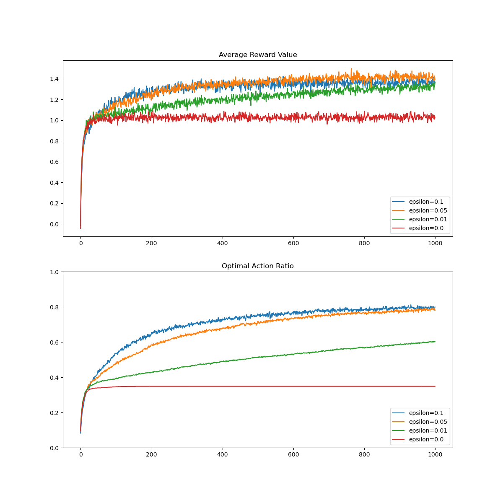
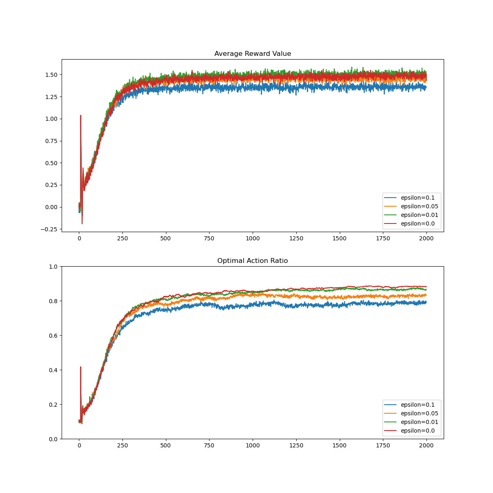

# Chapter 2

## K-armed Bandit Testbed Implementation

#### Graphs for basic implementation with various parameters

- 10 arms
- $\epsilon$-greedy values: .1, .05, .01, 0
- averages over 2000 runs
- 1000 steps

- 10 arms
- $\epsilon$-greedy values: .1, .05, .01, 0
- averages over 2000 runs
- 1000 steps
- optimistic initial value of 5
- non-stationary update rule

- 10 arms
- UCB constant values: 1, 2, 5, 10
- averages over 2000 runs
- 1000 steps

